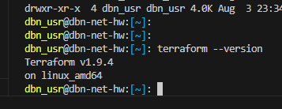
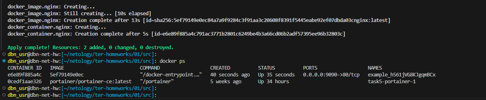
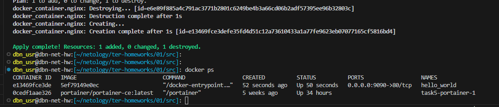

Домашнее задание к занятию «Введение в Terraform»

## Задача 0



## Задача 1

Изучите файл .gitignore. В каком terraform-файле, согласно этому .gitignore, допустимо сохранить личную, секретную информацию?(логины,пароли,ключи,токены итд)

Ответ:

в файле - personal.auto.tfvars

Выполните код проекта. Найдите в state-файле секретное содержимое созданного ресурса random_password, пришлите в качестве ответа конкретный ключ и его значение.

Ответ:

"result": "h561jVG8KJgqmBCx",

Раскомментируйте блок кода, примерно расположенный на строчках 29–42 файла main.tf. Выполните команду terraform validate. Объясните, в чём заключаются намеренно допущенные ошибки. Исправьте их.
Выполните код. В качестве ответа приложите: исправленный фрагмент кода и вывод команды docker ps

[main.tf](main.tf)

```console
dbn_usr@dbn-net-hw:[~/netology/ter-homeworks/01/src]: docker ps
CONTAINER ID   IMAGE                           COMMAND                  CREATED          STATUS          PORTS                  NAMES
e6e89f885a4c   5ef79149e0ec                    "/docker-entrypoint.…"   40 seconds ago   Up 35 seconds   0.0.0.0:9090->80/tcp   example_h561jVG8KJgqmBCx
0cedf1aae326   portainer/portainer-ce:latest   "/portainer"             5 weeks ago      Up 34 hours                            task5-portainer-1
dbn_usr@dbn-net-hw:[~/netology/ter-homeworks/01/src]: 
```


 Объясните своими словами, в чём может быть опасность применения ключа -auto-approve. Догадайтесь или нагуглите зачем может пригодиться данный ключ?

Ответ:

В нашем случае произошла замена контейнера, а не только смена его имени, что в свою очередь может привести к проблемам к работающей системе.
Данный ключ опасен тем, что можно применить автоматом нежелательные и/или непредсказуемые изменения без проверки и их подтверждения, создание лишних ресурсов и плату за них. Потерять данные.

Полезность ключа -auto-approve думаю заключается в автоматизации - применение конфига терраформа в тихом режиме без интерактивного вывода в консоль.

```console
dbn_usr@dbn-net-hw:[~/netology/ter-homeworks/01/src]: docker ps
CONTAINER ID   IMAGE                           COMMAND                  CREATED          STATUS          PORTS                  NAMES
e13469fce3de   5ef79149e0ec                    "/docker-entrypoint.…"   52 seconds ago   Up 50 seconds   0.0.0.0:9090->80/tcp   hello_world
0cedf1aae326   portainer/portainer-ce:latest   "/portainer"             5 weeks ago      Up 34 hours                            task5-portainer-1
dbn_usr@dbn-net-hw:[~/netology/ter-homeworks/01/src]: 
```



Уничтожьте созданные ресурсы с помощью terraform. Убедитесь, что все ресурсы удалены. Приложите содержимое файла terraform.tfstate.

[terraform.tfstate](terraform.tfstate)


Объясните, почему при этом не был удалён docker-образ nginx:latest. Ответ ОБЯЗАТЕЛЬНО НАЙДИТЕ В ПРЕДОСТАВЛЕННОМ КОДЕ, а затем ОБЯЗАТЕЛЬНО ПОДКРЕПИТЕ строчкой из документации terraform провайдера docker. (ищите в классификаторе resource docker_image )

```console
resource "docker_image" "nginx" {
  name         = "nginx:latest"
  keep_locally = true
}
```
Булевая переменная (параметр) keep_locally = true со значением "правда" означает хранить образ локально на сервере.

Ответ:

**keep_locally (Boolean) If true, then the Docker image won't be deleted on destroy operation. If this is false, it will delete the image from the docker local storage on destroy operation.**

https://docs.comcloud.xyz/providers/kreuzwerker/docker/3.0.1/docs/resources/image
