Домашнее задание к занятию «Основы Terraform. Yandex Cloud»

## Задача 1

Инициализируйте проект, выполните код. Исправьте намеренно допущенные синтаксические ошибки. Ищите внимательно, посимвольно. Ответьте, в чём заключается их суть.

Ответ:

Ошибка заключается в том, что в файле main.tf был указан неверный номер платформы №4, которая не фигурирует в доках, и с ошибкой в именовании.
Исправил: standar"d"-v4, а не standar"t"-v4. Исполдьзовал в работе платфорсу - №2 "Intel Cascade Lake (standard-v2), т.к. самая дешевая.
https://yandex.cloud/ru/docs/compute/concepts/vm-platforms

Также в файле main.tf было указано одно ядро, а для разворачивания ВМ на Yandex Cloud - минимальное количество ядер для платформы №2 "Intel Cascade Lake (standard-v2)" равно 2.
https://yandex.cloud/ru/docs/compute/concepts/performance-levels

```console
resource "yandex_compute_instance" "platform" {
  name        = "netology-develop-platform-web"
  platform_id = "standart-v4"
  resources {
    cores         = 1
    memory        = 1
    core_fraction = 5
  }
```
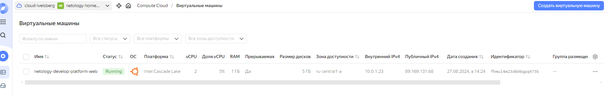

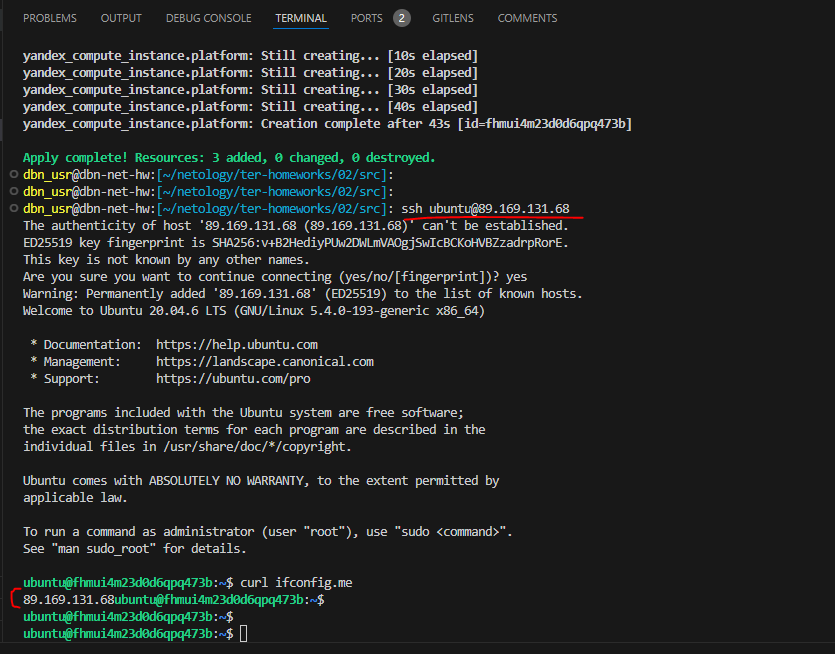


Ответьте, как в процессе обучения могут пригодиться параметры preemptible = true и core_fraction=5 в параметрах ВМ.

Ответ:

"preemptible = true"
параметр создает прерываюмую ВМ, которая работает не более 24 часов и может быть остановлена Compute Cloud в любой момент

Например, если забыл удалить ресурсы на Yandex Cloud в целях экономии денег и более дешевая ВМ.

"core_fraction=5"
параметр указывает на базовую производительность ядра в процентах = 5%

Гарантированная доля vCPU, которая будет выделена ВМ. ВМ с гарантированной долей меньше 100% обеспечивают указанный уровень производительности с вероятностью временного повышения вплоть до 100%. Такие ВМ подходят для задач, которые не требуют постоянной гарантии производительности vCPU на 100%. Как раз для обучения - сокращения финансровых затрат на ВМ.


## Задача 2

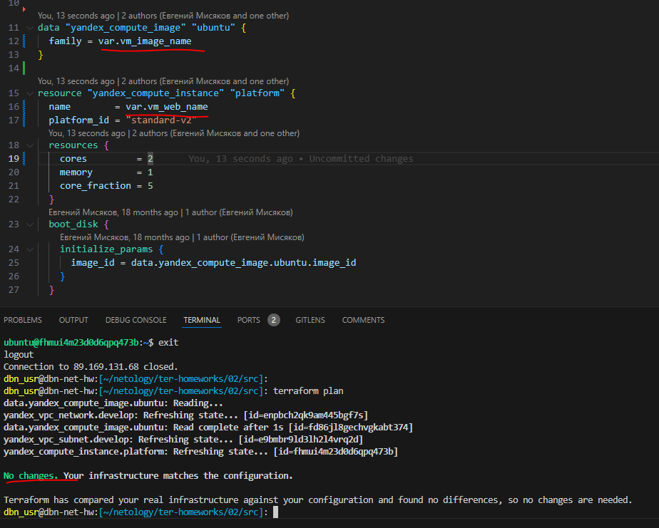


## Задача 3

```console
dbn_usr@dbn-net-hw:[~/netology/ter-homeworks/02/src]: terraform plan
data.yandex_compute_image.ubuntu: Reading...
yandex_vpc_network.develop: Refreshing state... [id=enpbch2qk9am445bgf7s]
data.yandex_compute_image.ubuntu: Read complete after 1s [id=fd86jl8gechvgkabt374]
yandex_vpc_subnet.develop: Refreshing state... [id=e9bmbr9ld3lh2l4vrq2d]
yandex_compute_instance.platform: Refreshing state... [id=fhmui4m23d0d6qpq473b]

Terraform used the selected providers to generate the following execution plan. Resource actions are indicated with the following symbols:
  + create

Terraform will perform the following actions:

  # yandex_compute_instance.db-platform will be created
  + resource "yandex_compute_instance" "db-platform" {
      + created_at                = (known after apply)
      + folder_id                 = (known after apply)
      + fqdn                      = (known after apply)
      + gpu_cluster_id            = (known after apply)
      + hostname                  = (known after apply)
      + id                        = (known after apply)
      + maintenance_grace_period  = (known after apply)
      + maintenance_policy        = (known after apply)
      + metadata                  = {
          + "serial-port-enable" = "1"
          + "ssh-keys"           = "ubuntu:ssh-ed25519 AAAAC3Nza*****"
        }
      + name                      = "netology-develop-platform-db"
      + network_acceleration_type = "standard"
      + platform_id               = "standard-v2"
      + service_account_id        = (known after apply)
      + status                    = (known after apply)
      + zone                      = (known after apply)

      + boot_disk {
          + auto_delete = true
          + device_name = (known after apply)
          + disk_id     = (known after apply)
          + mode        = (known after apply)

          + initialize_params {
              + block_size  = (known after apply)
              + description = (known after apply)
              + image_id    = "fd86jl8gechvgkabt374"
              + name        = (known after apply)
              + size        = (known after apply)
              + snapshot_id = (known after apply)
              + type        = "network-hdd"
            }
        }

      + metadata_options (known after apply)

      + network_interface {
          + index              = (known after apply)
          + ip_address         = (known after apply)
          + ipv4               = true
          + ipv6               = (known after apply)
          + ipv6_address       = (known after apply)
          + mac_address        = (known after apply)
          + nat                = true
          + nat_ip_address     = (known after apply)
          + nat_ip_version     = (known after apply)
          + security_group_ids = (known after apply)
          + subnet_id          = "e9bmbr9ld3lh2l4vrq2d"
        }

      + placement_policy (known after apply)

      + resources {
          + core_fraction = 20
          + cores         = 2
          + memory        = 2
        }

      + scheduling_policy {
          + preemptible = true
        }
    }

  # yandex_vpc_network.db_develop will be created
  + resource "yandex_vpc_network" "db_develop" {
      + created_at                = (known after apply)
      + default_security_group_id = (known after apply)
      + folder_id                 = (known after apply)
      + id                        = (known after apply)
      + labels                    = (known after apply)
      + name                      = "db_develop"
      + subnet_ids                = (known after apply)
    }

  # yandex_vpc_subnet.db_develop will be created
  + resource "yandex_vpc_subnet" "db_develop" {
      + created_at     = (known after apply)
      + folder_id      = (known after apply)
      + id             = (known after apply)
      + labels         = (known after apply)
      + name           = "db_develop"
      + network_id     = (known after apply)
      + v4_cidr_blocks = [
          + "10.0.1.0/24",
        ]
      + v6_cidr_blocks = (known after apply)
      + zone           = "ru-central1-b"
    }

Plan: 3 to add, 0 to change, 0 to destroy.

───────────────────────────────────────────────────────────────────────────────────────────────────────────────────────────────────────
```

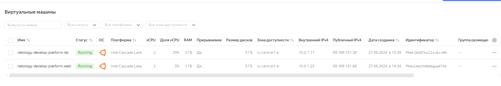

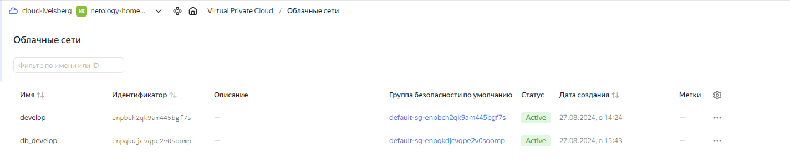

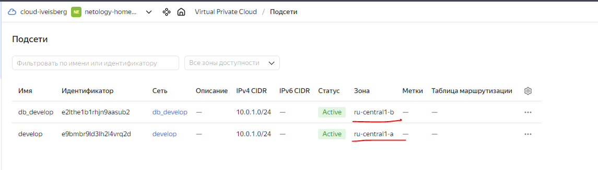


## Задача 4

[outputs.tf](outputs.tf)

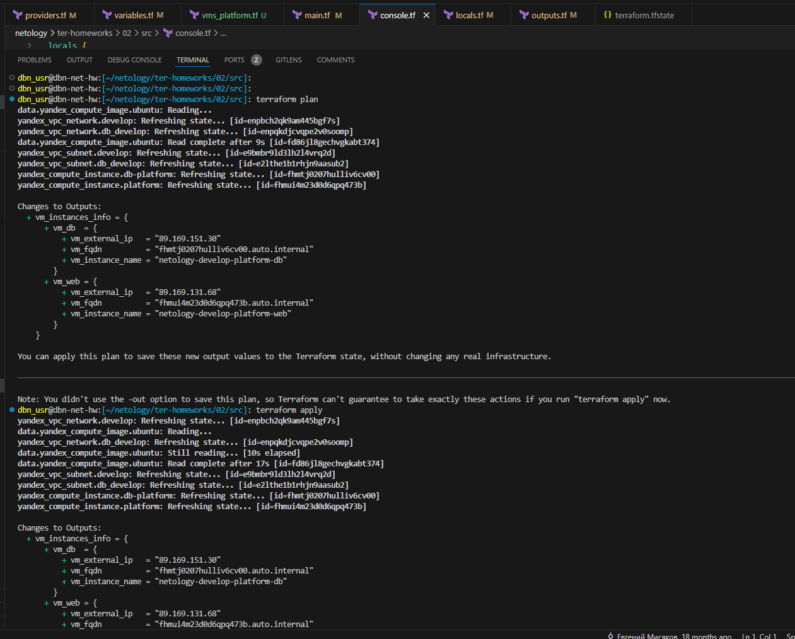

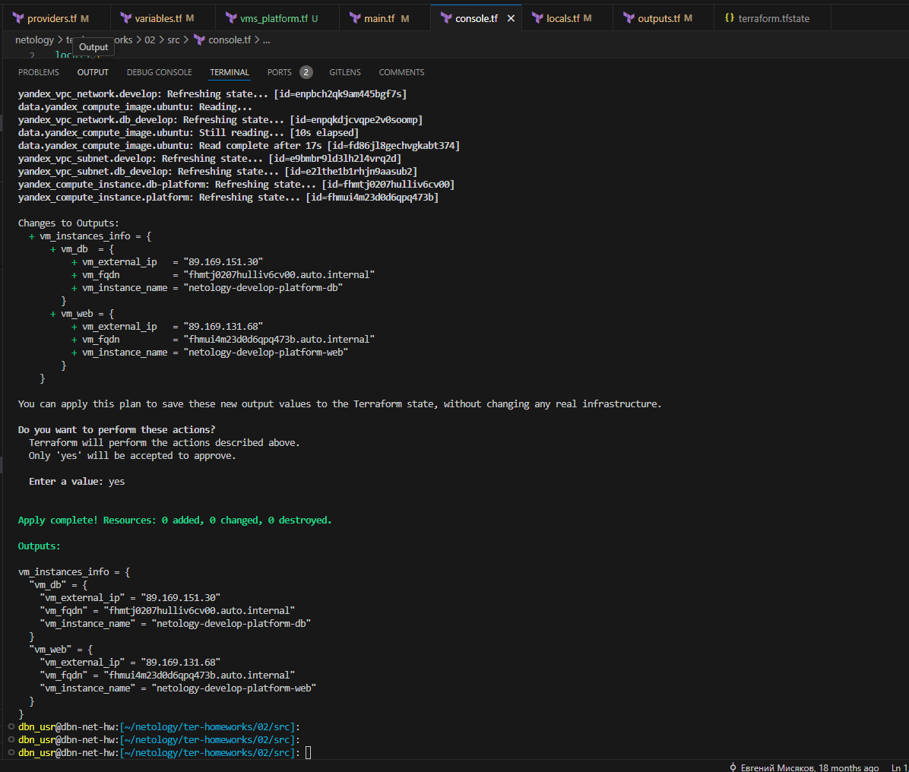

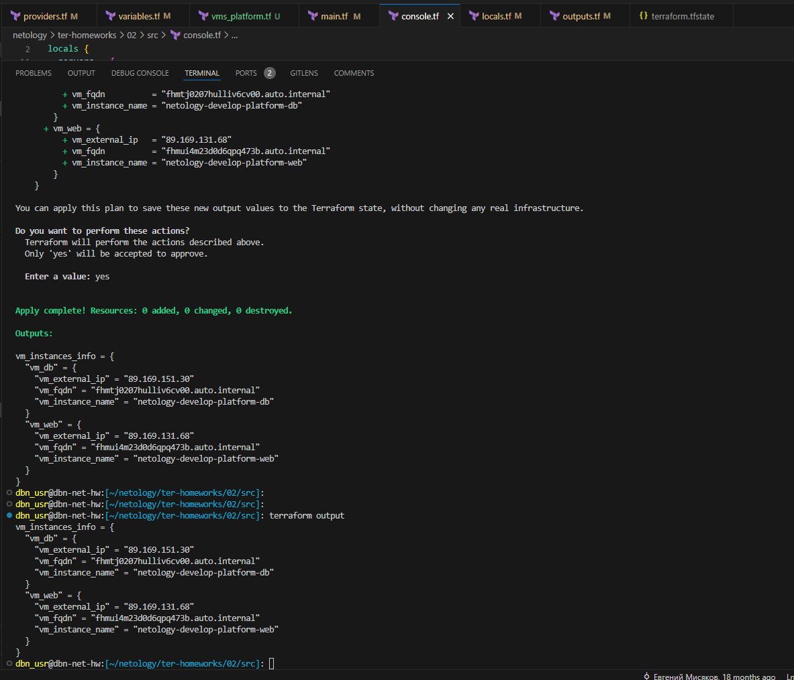

```console
dbn_usr@dbn-net-hw:[~/netology/ter-homeworks/02/src]: terraform output 
vm_instances_info = {
  "vm_db" = {
    "vm_external_ip" = "89.169.151.30"
    "vm_fqdn" = "fhmtj0207hulliv6cv00.auto.internal"
    "vm_instance_name" = "netology-develop-platform-db"
  }
  "vm_web" = {
    "vm_external_ip" = "89.169.131.68"
    "vm_fqdn" = "fhmui4m23d0d6qpq473b.auto.internal"
    "vm_instance_name" = "netology-develop-platform-web"
  }
}
dbn_usr@dbn-net-hw:[~/netology/ter-homeworks/02/src]: 
```


## Задача 5

[locals.tf](locals.tf)


## Задача 6

[vms_platform.tf](vms_platform.tf)

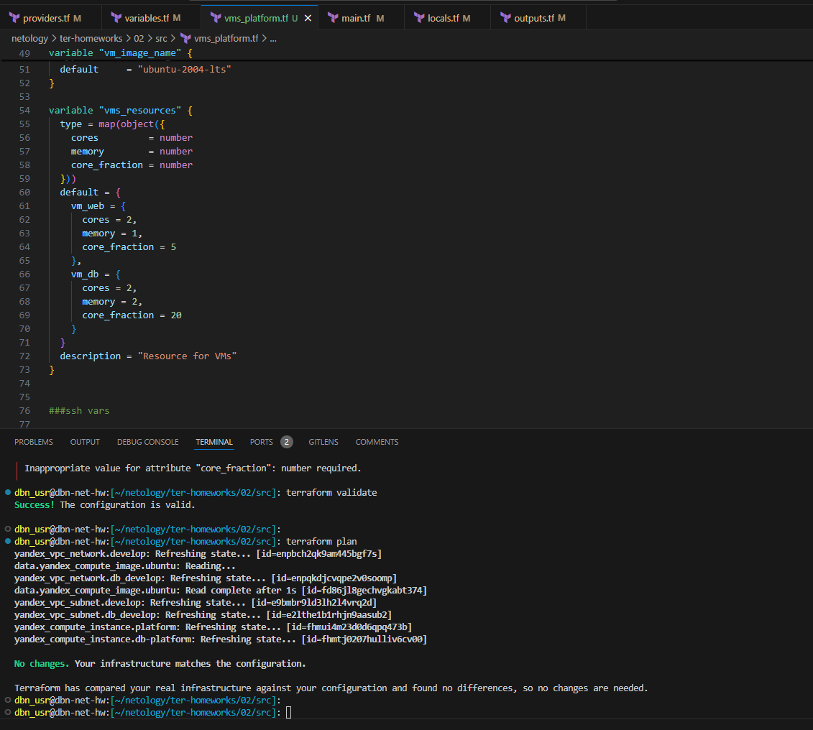

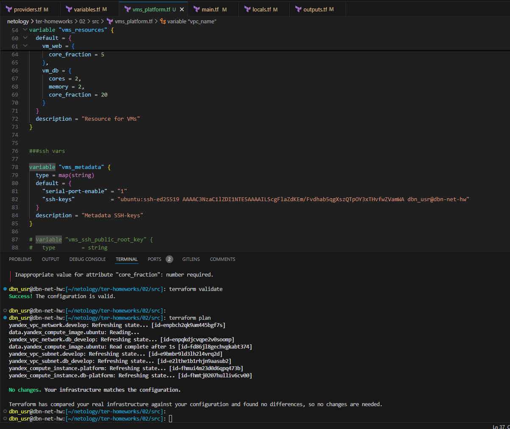


