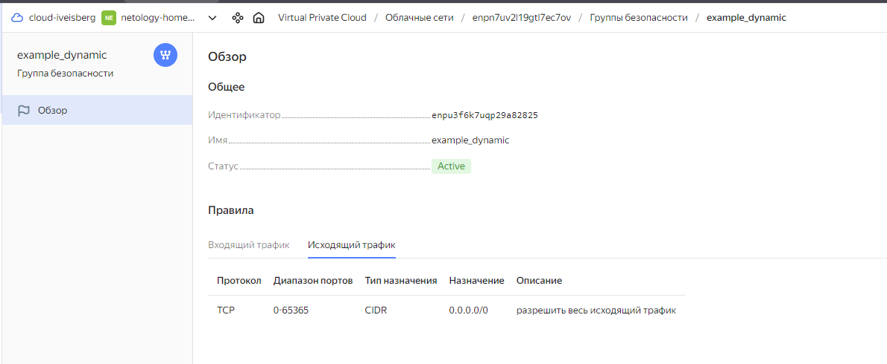
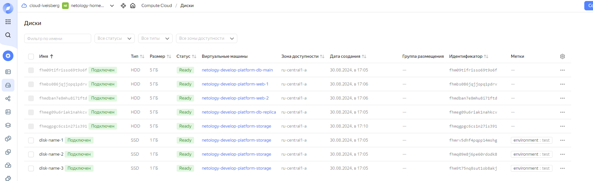

Домашнее задание к занятию «Управляющие конструкции в коде Terraform»

## Задача 1





## Задача 2,3

[count-vm.tf](count-vm.tf)

[for_each-vm.tf](for_each-vm.tf)
[for_each-vm.tf](for_each-vm.tf)





[disk_vm.tf](disk_vm.tf)


```console
dbn_usr@dbn-net-hw:[~/netology/ter-homeworks/03/src]: ssh ubuntu@89.169.146.54
The authenticity of host '89.169.146.54 (89.169.146.54)' can't be established.
ED25519 key fingerprint is SHA256:wqTBjKuYAv2HMpdTb3Ko/JgiHwV9cMuzPUU9S5ZDM3E.
This key is not known by any other names.
Are you sure you want to continue connecting (yes/no/[fingerprint])? yes
Warning: Permanently added '89.169.146.54' (ED25519) to the list of known hosts.
Welcome to Ubuntu 20.04.6 LTS (GNU/Linux 5.4.0-193-generic x86_64)

 * Documentation:  https://help.ubuntu.com
 * Management:     https://landscape.canonical.com
 * Support:        https://ubuntu.com/pro

The programs included with the Ubuntu system are free software;
the exact distribution terms for each program are described in the
individual files in /usr/share/doc/*/copyright.

Ubuntu comes with ABSOLUTELY NO WARRANTY, to the extent permitted by
applicable law.

To run a command as administrator (user "root"), use "sudo <command>".
See "man sudo_root" for details.

ubuntu@fhmk2v5j9nvdmp2sgn5o:~$ 
ubuntu@fhmk2v5j9nvdmp2sgn5o:~$ lsblk
NAME   MAJ:MIN RM SIZE RO TYPE MOUNTPOINT
vda    252:0    0   5G  0 disk 
├─vda1 252:1    0   1M  0 part 
└─vda2 252:2    0   5G  0 part /
vdb    252:16   0   1G  0 disk 
vdc    252:32   0   1G  0 disk 
vdd    252:48   0   1G  0 disk 
ubuntu@fhmk2v5j9nvdmp2sgn5o:~$ df -h
Filesystem      Size  Used Avail Use% Mounted on
udev            452M     0  452M   0% /dev
tmpfs            97M  2.0M   95M   3% /run
/dev/vda2       4.9G  2.6G  2.1G  56% /
tmpfs           483M     0  483M   0% /dev/shm
tmpfs           5.0M     0  5.0M   0% /run/lock
tmpfs           483M     0  483M   0% /sys/fs/cgroup
tmpfs            97M     0   97M   0% /run/user/1000
ubuntu@fhmk2v5j9nvdmp2sgn5o:~$ 
```


## Задача 4

[ansible.tf](ansible.tf)

[inventory.tftpl](inventory.tftpl)

[inventory.ini](inventory.ini)


