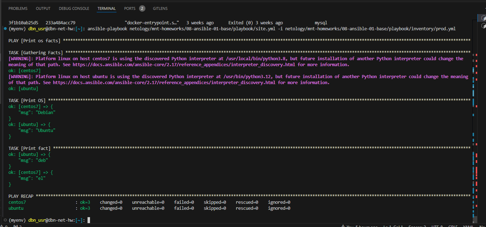

Домашнее задание к занятию 1 «Введение в Ansible»

## Задача 1


## Задача 4

Вместо ОС CentOS использовал Debian. Именование группы хостов не менял, думаю для этого задания пойдет и так, сути не меняет же.



## Задача 6


## Задача 8


## Задача 11


# Необязательная часть

## Задача 1-3


## Задача 4

```console
(myenv) dbn_usr@dbn-net-hw:[~]: ansible-playbook netology/mnt-homeworks/08-ansible-01-base/playbook/site.yml -i netology/mnt-homeworks/08-ansible-01-base/playbook/inventory/prod.yml --ask-vault-pass
Vault password: 
[WARNING]: Found both group and host with same name: fedora

PLAY [Print os facts] ******************************************************************************************************************************************************************************************

TASK [Gathering Facts] *****************************************************************************************************************************************************************************************
[WARNING]: Platform linux on host localhost is using the discovered Python interpreter at /home/dbn_usr/myenv/bin/python3.11, but future installation of another Python interpreter could change the meaning of
that path. See https://docs.ansible.com/ansible-core/2.17/reference_appendices/interpreter_discovery.html for more information.
ok: [localhost]
[WARNING]: Platform linux on host ubuntu is using the discovered Python interpreter at /usr/bin/python3.12, but future installation of another Python interpreter could change the meaning of that path. See
https://docs.ansible.com/ansible-core/2.17/reference_appendices/interpreter_discovery.html for more information.
ok: [ubuntu]
[WARNING]: Platform linux on host fedora is using the discovered Python interpreter at /usr/bin/python3.9, but future installation of another Python interpreter could change the meaning of that path. See
https://docs.ansible.com/ansible-core/2.17/reference_appendices/interpreter_discovery.html for more information.
ok: [fedora]
[WARNING]: Platform linux on host centos7 is using the discovered Python interpreter at /usr/local/bin/python3.8, but future installation of another Python interpreter could change the meaning of that path.
See https://docs.ansible.com/ansible-core/2.17/reference_appendices/interpreter_discovery.html for more information.
ok: [centos7]

TASK [Print OS] ************************************************************************************************************************************************************************************************
ok: [centos7] => {
    "msg": "Debian"
}
ok: [ubuntu] => {
    "msg": "Ubuntu"
}
ok: [localhost] => {
    "msg": "Debian"
}
ok: [fedora] => {
    "msg": "Fedora"
}

TASK [Print fact] **********************************************************************************************************************************************************************************************
ok: [centos7] => {
    "msg": "el default fact"
}
ok: [ubuntu] => {
    "msg": "deb default fact"
}
ok: [localhost] => {
    "msg": "all default fact"
}
ok: [fedora] => {
    "msg": "fedora default fact"
}

TASK [Print fact 2] ********************************************************************************************************************************************************************************************
ok: [centos7] => {
    "msg": "PaSSw0rd"
}
ok: [ubuntu] => {
    "msg": "PaSSw0rd"
}
ok: [localhost] => {
    "msg": "PaSSw0rd"
}
ok: [fedora] => {
    "msg": "PaSSw0rd"
}

PLAY RECAP *****************************************************************************************************************************************************************************************************
centos7                    : ok=4    changed=0    unreachable=0    failed=0    skipped=0    rescued=0    ignored=0   
fedora                     : ok=4    changed=0    unreachable=0    failed=0    skipped=0    rescued=0    ignored=0   
localhost                  : ok=4    changed=0    unreachable=0    failed=0    skipped=0    rescued=0    ignored=0   
ubuntu                     : ok=4    changed=0    unreachable=0    failed=0    skipped=0    rescued=0    ignored=0   

(myenv) dbn_usr@dbn-net-hw:[~]: 
```

## Задача 5


```console
(myenv) dbn_usr@dbn-net-hw:[~]: ./auto_run_docker_ansible_stop.sh 
f1ddf99ad2bf528e591fbfbfb39d1542aa2403bea7fef8c0a3eb61a6108fcca8
360b4520590140f197bdd93af43e78d8a67d29ee7e526e7835d0037533d549b3
237c2fecacec52c8b9857d942860f3b1fe617d7f4167c0800f7096b63fda2154
Vault password: 
[WARNING]: Found both group and host with same name: fedora

PLAY [Print os facts] ******************************************************************************************************************************************************************************************

TASK [Gathering Facts] *****************************************************************************************************************************************************************************************
[WARNING]: Platform linux on host localhost is using the discovered Python interpreter at /home/dbn_usr/myenv/bin/python3.11, but future installation of another Python interpreter could change the meaning of
that path. See https://docs.ansible.com/ansible-core/2.17/reference_appendices/interpreter_discovery.html for more information.
ok: [localhost]
[WARNING]: Platform linux on host centos7 is using the discovered Python interpreter at /usr/local/bin/python3.8, but future installation of another Python interpreter could change the meaning of that path.
See https://docs.ansible.com/ansible-core/2.17/reference_appendices/interpreter_discovery.html for more information.
ok: [centos7]
[WARNING]: Platform linux on host fedora is using the discovered Python interpreter at /usr/bin/python3.9, but future installation of another Python interpreter could change the meaning of that path. See
https://docs.ansible.com/ansible-core/2.17/reference_appendices/interpreter_discovery.html for more information.
ok: [fedora]
[WARNING]: Platform linux on host ubuntu is using the discovered Python interpreter at /usr/bin/python3.12, but future installation of another Python interpreter could change the meaning of that path. See
https://docs.ansible.com/ansible-core/2.17/reference_appendices/interpreter_discovery.html for more information.
ok: [ubuntu]

TASK [Print OS] ************************************************************************************************************************************************************************************************
ok: [centos7] => {
    "msg": "Debian"
}
ok: [ubuntu] => {
    "msg": "Ubuntu"
}
ok: [localhost] => {
    "msg": "Debian"
}
ok: [fedora] => {
    "msg": "Fedora"
}

TASK [Print fact] **********************************************************************************************************************************************************************************************
ok: [centos7] => {
    "msg": "el default fact"
}
ok: [ubuntu] => {
    "msg": "deb default fact"
}
ok: [localhost] => {
    "msg": "all default fact"
}
ok: [fedora] => {
    "msg": "fedora default fact"
}

TASK [Print fact 2] ********************************************************************************************************************************************************************************************
ok: [centos7] => {
    "msg": "PaSSw0rd"
}
ok: [ubuntu] => {
    "msg": "PaSSw0rd"
}
ok: [localhost] => {
    "msg": "PaSSw0rd"
}
ok: [fedora] => {
    "msg": "PaSSw0rd"
}

PLAY RECAP *****************************************************************************************************************************************************************************************************
centos7                    : ok=4    changed=0    unreachable=0    failed=0    skipped=0    rescued=0    ignored=0   
fedora                     : ok=4    changed=0    unreachable=0    failed=0    skipped=0    rescued=0    ignored=0   
localhost                  : ok=4    changed=0    unreachable=0    failed=0    skipped=0    rescued=0    ignored=0   
ubuntu                     : ok=4    changed=0    unreachable=0    failed=0    skipped=0    rescued=0    ignored=0   

ubuntu
centos7
fedora
(myenv) dbn_usr@dbn-net-hw:[~]:
```
