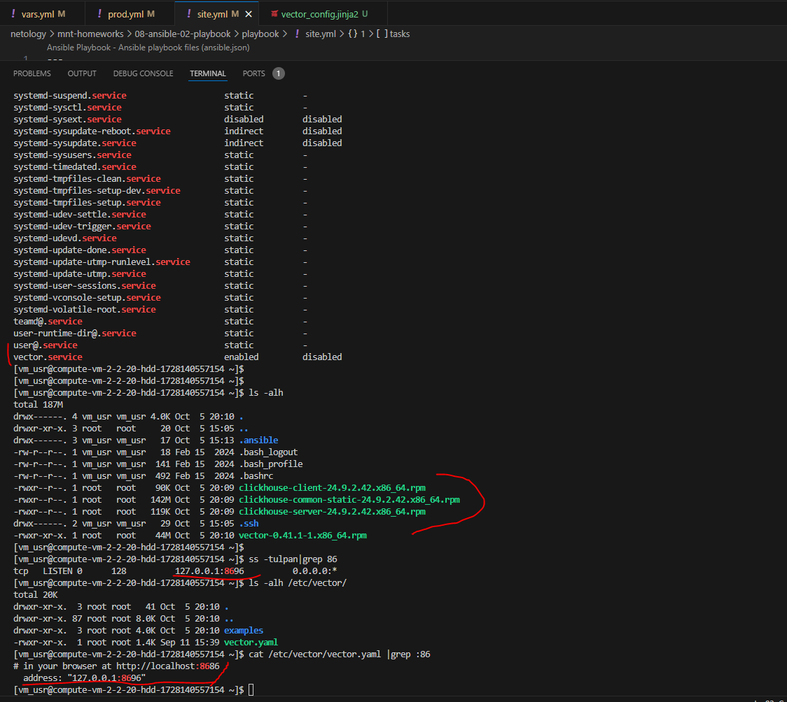
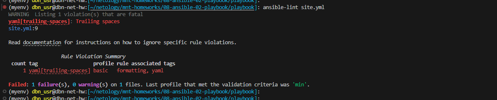
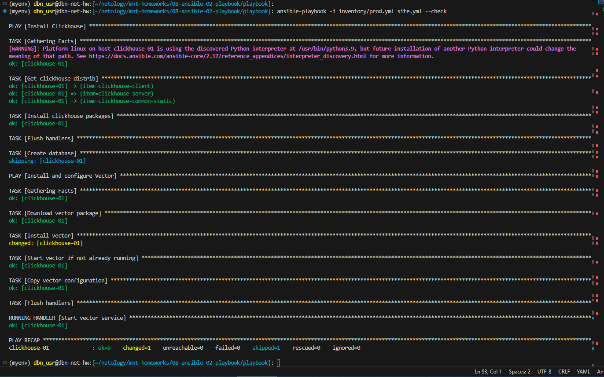
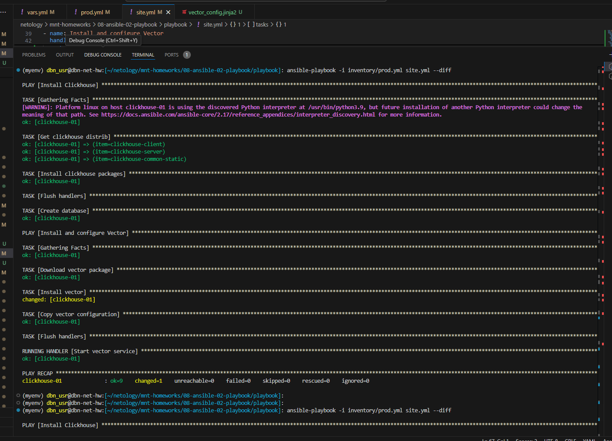
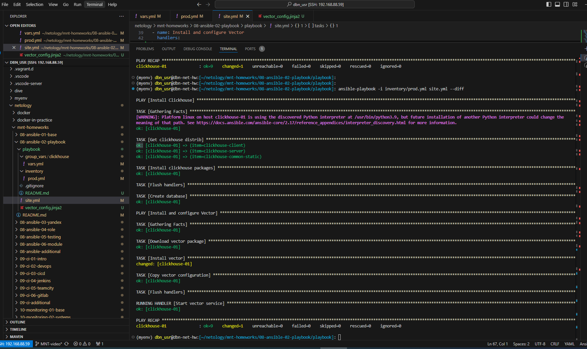

Домашнее задание к занятию 2 «Работа с Playbook»

## Задача 1

[prod.yml](playbook/inventory/prod.yml)

## Задача 2-4

[site.yml](playbook/site.yml)

## Задача 5

## Задача 6

## Задача 7

## Задача 8

## Задача 9

[README.md](playbook/README.md)
