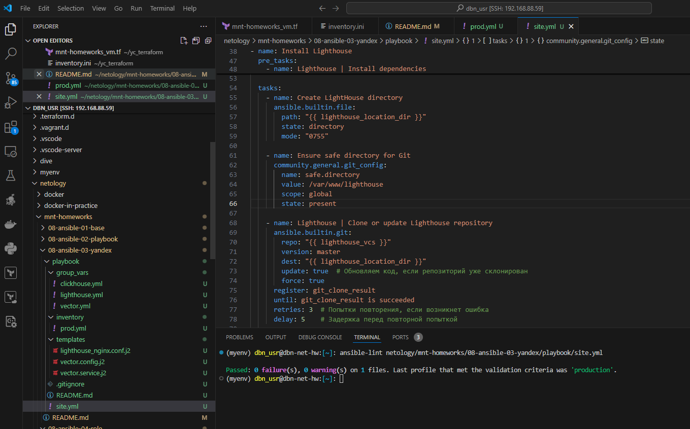
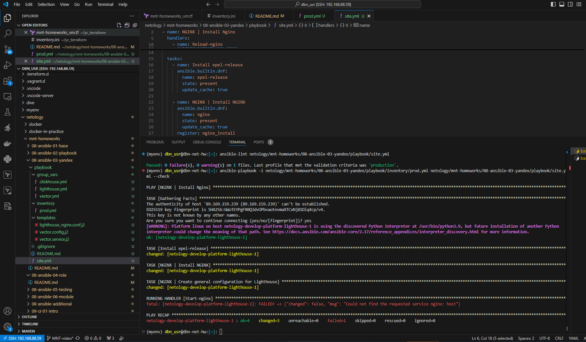
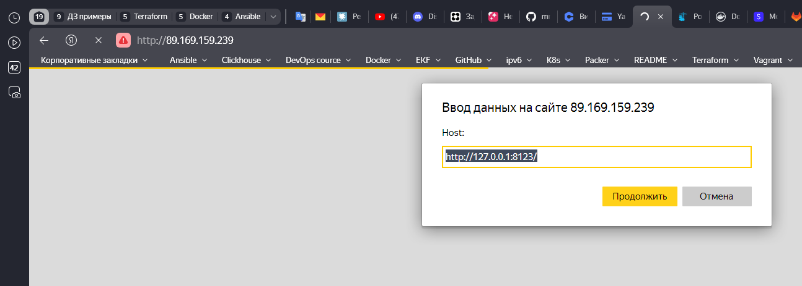

Домашнее задание к занятию 3 «Использование Ansible»

## Задача 1-3

[site.yml](playbook/site.yml)


## Задача 4

[prod.yml](playbook/inventory/prod.yml)


## Задача 5




## Задача 6




## Задача 7

```python
(myenv) dbn_usr@dbn-net-hw:[~]: ansible-playbook -i netology/mnt-homeworks/08-ansible-03-yandex/playbook/inventory/prod.yml netology/mnt-homeworks/08-ansible-03-yandex/playbook/site.yml --diff

PLAY [NGINX | Install Nginx] **********************************************************************************************************************************************************

TASK [Gathering Facts] ****************************************************************************************************************************************************************
[WARNING]: Platform linux on host netology-develop-platform-lighthouse-1 is using the discovered Python interpreter at /usr/bin/python3.9, but future installation of another Python
interpreter could change the meaning of that path. See https://docs.ansible.com/ansible-core/2.17/reference_appendices/interpreter_discovery.html for more information.
ok: [netology-develop-platform-lighthouse-1]

TASK [Install epel-release] ***********************************************************************************************************************************************************
changed: [netology-develop-platform-lighthouse-1]

TASK [NGINX | Install NGINX] **********************************************************************************************************************************************************
changed: [netology-develop-platform-lighthouse-1]

TASK [NGINX | Create general configuration for Lighthouse] ****************************************************************************************************************************
--- before: /etc/nginx/nginx.conf
+++ after: /home/dbn_usr/.ansible/tmp/ansible-local-89498yyfif04l/tmpqjc0_zzs/lighthouse_nginx.conf.j2
@@ -38,8 +38,18 @@
     server {
         listen       80;
         listen       [::]:80;
-        server_name  _;
-        root         /usr/share/nginx/html;
+        server_name  89.169.159.239;
+        root         /var/www/lighthouse;
+        index index.html;
+
+        location / {
+          try_files $uri $uri/ =404;  # Попробовать найти файл, если не найден - вернуть 404
+        }
+
+        location ~* \.(js|css|png|jpg|jpeg|gif|ico|svg|woff|woff2|ttf|eot)$ {
+          expires 30d;
+          access_log off;
+        }
 
         # Load configuration files for the default server block.
         include /etc/nginx/default.d/*.conf;
@@ -81,4 +91,3 @@
 #    }
 
 }
-

changed: [netology-develop-platform-lighthouse-1]

RUNNING HANDLER [Start-nginx] *********************************************************************************************************************************************************
changed: [netology-develop-platform-lighthouse-1]

RUNNING HANDLER [Reload-nginx] ********************************************************************************************************************************************************
changed: [netology-develop-platform-lighthouse-1]

PLAY [Install Lighthouse] *************************************************************************************************************************************************************

TASK [Gathering Facts] ****************************************************************************************************************************************************************
ok: [netology-develop-platform-lighthouse-1]

TASK [Lighthouse | Install dependencies] **********************************************************************************************************************************************
changed: [netology-develop-platform-lighthouse-1]

TASK [Create LightHouse directory] ****************************************************************************************************************************************************
--- before
+++ after
@@ -1,4 +1,4 @@
 {
     "path": "/var/www/lighthouse",
-    "state": "absent"
+    "state": "directory"
 }

changed: [netology-develop-platform-lighthouse-1]

TASK [Ensure safe directory for Git] **************************************************************************************************************************************************
--- before: /bin/git config --includes --global --replace-all safe.directory /var/www/lighthouse
+++ after: /bin/git config --includes --global --replace-all safe.directory /var/www/lighthouse
@@ -1 +1 @@
-
+/var/www/lighthouse

changed: [netology-develop-platform-lighthouse-1]

TASK [Lighthouse | Clone or update Lighthouse repository] *****************************************************************************************************************************
>> Newly checked out d701335c25cd1bb9b5155711190bad8ab852c2ce
changed: [netology-develop-platform-lighthouse-1]

TASK [Ensure correct permissions for LightHouse files] ********************************************************************************************************************************
ok: [netology-develop-platform-lighthouse-1]

TASK [Ensure correct file modes for LightHouse files] *********************************************************************************************************************************
ok: [netology-develop-platform-lighthouse-1]

PLAY [Install Clickhouse] *************************************************************************************************************************************************************

TASK [Gathering Facts] ****************************************************************************************************************************************************************
The authenticity of host '84.201.172.183 (84.201.172.183)' can't be established.
ED25519 key fingerprint is SHA256:lAnhdQS8NNs0stDyO2ohdZHqWT4D7/IlJ/MsBDhFt3c.
This key is not known by any other names.
Are you sure you want to continue connecting (yes/no/[fingerprint])? yes
[WARNING]: Platform linux on host netology-develop-platform-clickhouse-1 is using the discovered Python interpreter at /usr/bin/python3.9, but future installation of another Python
interpreter could change the meaning of that path. See https://docs.ansible.com/ansible-core/2.17/reference_appendices/interpreter_discovery.html for more information.
ok: [netology-develop-platform-clickhouse-1]

TASK [Get distrib] ********************************************************************************************************************************************************************
changed: [netology-develop-platform-clickhouse-1] => (item=clickhouse-client)
changed: [netology-develop-platform-clickhouse-1] => (item=clickhouse-server)
changed: [netology-develop-platform-clickhouse-1] => (item=clickhouse-common-static)

TASK [Install clickhouse packages] ****************************************************************************************************************************************************
changed: [netology-develop-platform-clickhouse-1]

TASK [Flush handlers] *****************************************************************************************************************************************************************

RUNNING HANDLER [Start clickhouse service] ********************************************************************************************************************************************
changed: [netology-develop-platform-clickhouse-1]

TASK [Create database] ****************************************************************************************************************************************************************
changed: [netology-develop-platform-clickhouse-1]

PLAY [Install Vector] *****************************************************************************************************************************************************************

TASK [Gathering Facts] ****************************************************************************************************************************************************************
The authenticity of host '89.169.157.7 (89.169.157.7)' can't be established.
ED25519 key fingerprint is SHA256:U4UKjydSQQU0EswqKJ/mRFSLRfJs7Xsq1JYitJJ+0YE.
This key is not known by any other names.
Are you sure you want to continue connecting (yes/no/[fingerprint])? yes
[WARNING]: Platform linux on host netology-develop-platform-vector-1 is using the discovered Python interpreter at /usr/bin/python3.9, but future installation of another Python
interpreter could change the meaning of that path. See https://docs.ansible.com/ansible-core/2.17/reference_appendices/interpreter_discovery.html for more information.
ok: [netology-develop-platform-vector-1]

TASK [Vector | Install rpm] ***********************************************************************************************************************************************************
changed: [netology-develop-platform-vector-1]

TASK [Vector | Template config] *******************************************************************************************************************************************************
--- before: /etc/vector/vector.yaml
+++ after: /home/dbn_usr/.ansible/tmp/ansible-local-89498yyfif04l/tmp7aou2c4j/vector.config.j2
@@ -1,49 +1,17 @@
-#                                    __   __  __
-#                                    \ \ / / / /
-#                                     \ V / / /
-#                                      \_/  \/
-#
-#                                    V E C T O R
-#                                   Configuration
-#
-# ------------------------------------------------------------------------------
-# Website: https://vector.dev
-# Docs: https://vector.dev/docs
-# Chat: https://chat.vector.dev
-# ------------------------------------------------------------------------------
-
-# Change this to use a non-default directory for Vector data storage:
-# data_dir: "/var/lib/vector"
-
-# Random Syslog-formatted logs
+sinks:
+    to_clickhouse:
+        database: custom
+        endpoint: http://89.169.159.239:8123
+        healthcheck: false
+        inputs:
+        - our_log
+        skip_unknown_fields: true
+        table: my_table
+        type: clickhouse
 sources:
-  dummy_logs:
-    type: "demo_logs"
-    format: "syslog"
-    interval: 1
-
-# Parse Syslog logs
-# See the Vector Remap Language reference for more info: https://vrl.dev
-transforms:
-  parse_logs:
-    type: "remap"
-    inputs: ["dummy_logs"]
-    source: |
-      . = parse_syslog!(string!(.message))
-
-# Print parsed logs to stdout
-sinks:
-  print:
-    type: "console"
-    inputs: ["parse_logs"]
-    encoding:
-      codec: "json"
-      json:
-        pretty: true
-
-# Vector's GraphQL API (disabled by default)
-# Uncomment to try it out with the `vector top` command or
-# in your browser at http://localhost:8686
-# api:
-#   enabled: true
-#   address: "127.0.0.1:8686"
+    our_log:
+        ignore_older_secs: 600
+        include:
+        - /home/dbn_usr/logs/*.log
+        read_from: beginning
+        type: file

changed: [netology-develop-platform-vector-1]

TASK [Vector | Create systemd unit] ***************************************************************************************************************************************************
--- before
+++ after: /home/dbn_usr/.ansible/tmp/ansible-local-89498yyfif04l/tmpobdpkt1q/vector.service.j2
@@ -0,0 +1,15 @@
+# vector.service.j2
+
+[Unit]
+Description=Vector Service
+After=network.target
+
+[Service]
+ExecStart=/usr/bin/vector /etc/vector/vector.yaml
+Restart=always
+User=root
+Group=0
+Environment=VECTOR_ENV=production
+
+[Install]
+WantedBy=multi-user.target

changed: [netology-develop-platform-vector-1]

TASK [Vector | Start service] *********************************************************************************************************************************************************
changed: [netology-develop-platform-vector-1]

PLAY RECAP ****************************************************************************************************************************************************************************
netology-develop-platform-clickhouse-1 : ok=5    changed=4    unreachable=0    failed=0    skipped=0    rescued=0    ignored=0   
netology-develop-platform-lighthouse-1 : ok=13   changed=9    unreachable=0    failed=0    skipped=0    rescued=0    ignored=0   
netology-develop-platform-vector-1 : ok=5    changed=4    unreachable=0    failed=0    skipped=0    rescued=0    ignored=0   

(myenv) dbn_usr@dbn-net-hw:[~]: 
```

## Задача 8

```python
(myenv) dbn_usr@dbn-net-hw:[~]: ansible-playbook -i netology/mnt-homeworks/08-ansible-03-yandex/playbook/inventory/prod.yml netology/mnt-homeworks/08-ansible-03-yandex/playbook/site.yml --diff

PLAY [NGINX | Install Nginx] **********************************************************************************************************************************************************

TASK [Gathering Facts] ****************************************************************************************************************************************************************
[WARNING]: Platform linux on host netology-develop-platform-lighthouse-1 is using the discovered Python interpreter at /usr/bin/python3.9, but future installation of another Python
interpreter could change the meaning of that path. See https://docs.ansible.com/ansible-core/2.17/reference_appendices/interpreter_discovery.html for more information.
ok: [netology-develop-platform-lighthouse-1]

TASK [Install epel-release] ***********************************************************************************************************************************************************
ok: [netology-develop-platform-lighthouse-1]

TASK [NGINX | Install NGINX] **********************************************************************************************************************************************************
changed: [netology-develop-platform-lighthouse-1]

TASK [NGINX | Create general configuration for Lighthouse] ****************************************************************************************************************************
ok: [netology-develop-platform-lighthouse-1]

RUNNING HANDLER [Start-nginx] *********************************************************************************************************************************************************
ok: [netology-develop-platform-lighthouse-1]

PLAY [Install Lighthouse] *************************************************************************************************************************************************************

TASK [Gathering Facts] ****************************************************************************************************************************************************************
ok: [netology-develop-platform-lighthouse-1]

TASK [Lighthouse | Install dependencies] **********************************************************************************************************************************************
ok: [netology-develop-platform-lighthouse-1]

TASK [Create LightHouse directory] ****************************************************************************************************************************************************
ok: [netology-develop-platform-lighthouse-1]

TASK [Ensure safe directory for Git] **************************************************************************************************************************************************
ok: [netology-develop-platform-lighthouse-1]

TASK [Lighthouse | Clone or update Lighthouse repository] *****************************************************************************************************************************
changed: [netology-develop-platform-lighthouse-1]

TASK [Ensure correct permissions for LightHouse files] ********************************************************************************************************************************
ok: [netology-develop-platform-lighthouse-1]

TASK [Ensure correct file modes for LightHouse files] *********************************************************************************************************************************
ok: [netology-develop-platform-lighthouse-1]

PLAY [Install Clickhouse] *************************************************************************************************************************************************************

TASK [Gathering Facts] ****************************************************************************************************************************************************************
[WARNING]: Platform linux on host netology-develop-platform-clickhouse-1 is using the discovered Python interpreter at /usr/bin/python3.9, but future installation of another Python
interpreter could change the meaning of that path. See https://docs.ansible.com/ansible-core/2.17/reference_appendices/interpreter_discovery.html for more information.
ok: [netology-develop-platform-clickhouse-1]

TASK [Get distrib] ********************************************************************************************************************************************************************
ok: [netology-develop-platform-clickhouse-1] => (item=clickhouse-client)
ok: [netology-develop-platform-clickhouse-1] => (item=clickhouse-server)
ok: [netology-develop-platform-clickhouse-1] => (item=clickhouse-common-static)

TASK [Install clickhouse packages] ****************************************************************************************************************************************************
ok: [netology-develop-platform-clickhouse-1]

TASK [Flush handlers] *****************************************************************************************************************************************************************

TASK [Create database] ****************************************************************************************************************************************************************
ok: [netology-develop-platform-clickhouse-1]

PLAY [Install Vector] *****************************************************************************************************************************************************************

TASK [Gathering Facts] ****************************************************************************************************************************************************************
[WARNING]: Platform linux on host netology-develop-platform-vector-1 is using the discovered Python interpreter at /usr/bin/python3.9, but future installation of another Python
interpreter could change the meaning of that path. See https://docs.ansible.com/ansible-core/2.17/reference_appendices/interpreter_discovery.html for more information.
ok: [netology-develop-platform-vector-1]

TASK [Vector | Install rpm] ***********************************************************************************************************************************************************
ok: [netology-develop-platform-vector-1]

TASK [Vector | Template config] *******************************************************************************************************************************************************
ok: [netology-develop-platform-vector-1]

TASK [Vector | Create systemd unit] ***************************************************************************************************************************************************
ok: [netology-develop-platform-vector-1]

TASK [Vector | Start service] *********************************************************************************************************************************************************
changed: [netology-develop-platform-vector-1]

PLAY RECAP ****************************************************************************************************************************************************************************
netology-develop-platform-clickhouse-1 : ok=4    changed=0    unreachable=0    failed=0    skipped=0    rescued=0    ignored=0   
netology-develop-platform-lighthouse-1 : ok=12   changed=2    unreachable=0    failed=0    skipped=0    rescued=0    ignored=0   
netology-develop-platform-vector-1 : ok=5    changed=1    unreachable=0    failed=0    skipped=0    rescued=0    ignored=0   

(myenv) dbn_usr@dbn-net-hw:[~]: 
```

### Запуск еще раз


```python
(myenv) dbn_usr@dbn-net-hw:[~]: 
(myenv) dbn_usr@dbn-net-hw:[~]: 
(myenv) dbn_usr@dbn-net-hw:[~]: 
(myenv) dbn_usr@dbn-net-hw:[~]: 
^[[A(myenv) dbn_usr@dbn-net-hw:[~]: ansible-playbook -i netology/mnt-homeworks/08-ansible-03-yandex/playbook/inventory/prod.yml netology/mnt-homeworks/08-ansible-03-yandex/playbook/site.yml

PLAY [NGINX | Install Nginx] **********************************************************************************************************************************************************

TASK [Gathering Facts] ****************************************************************************************************************************************************************
[WARNING]: Platform linux on host netology-develop-platform-lighthouse-1 is using the discovered Python interpreter at /usr/bin/python3.9, but future installation of another Python
interpreter could change the meaning of that path. See https://docs.ansible.com/ansible-core/2.17/reference_appendices/interpreter_discovery.html for more information.
ok: [netology-develop-platform-lighthouse-1]

TASK [Install epel-release] ***********************************************************************************************************************************************************
ok: [netology-develop-platform-lighthouse-1]

TASK [NGINX | Install NGINX] **********************************************************************************************************************************************************
changed: [netology-develop-platform-lighthouse-1]

TASK [NGINX | Create general configuration for Lighthouse] ****************************************************************************************************************************
ok: [netology-develop-platform-lighthouse-1]

RUNNING HANDLER [Start-nginx] *********************************************************************************************************************************************************
ok: [netology-develop-platform-lighthouse-1]

PLAY [Install Lighthouse] *************************************************************************************************************************************************************

TASK [Gathering Facts] ****************************************************************************************************************************************************************
ok: [netology-develop-platform-lighthouse-1]

TASK [Lighthouse | Install dependencies] **********************************************************************************************************************************************
ok: [netology-develop-platform-lighthouse-1]

TASK [Create LightHouse directory] ****************************************************************************************************************************************************
ok: [netology-develop-platform-lighthouse-1]

TASK [Ensure safe directory for Git] **************************************************************************************************************************************************
ok: [netology-develop-platform-lighthouse-1]

TASK [Lighthouse | Clone or update Lighthouse repository] *****************************************************************************************************************************
changed: [netology-develop-platform-lighthouse-1]

TASK [Ensure correct permissions for LightHouse files] ********************************************************************************************************************************
ok: [netology-develop-platform-lighthouse-1]

TASK [Ensure correct file modes for LightHouse files] *********************************************************************************************************************************
ok: [netology-develop-platform-lighthouse-1]

PLAY [Install Clickhouse] *************************************************************************************************************************************************************

TASK [Gathering Facts] ****************************************************************************************************************************************************************
[WARNING]: Platform linux on host netology-develop-platform-clickhouse-1 is using the discovered Python interpreter at /usr/bin/python3.9, but future installation of another Python
interpreter could change the meaning of that path. See https://docs.ansible.com/ansible-core/2.17/reference_appendices/interpreter_discovery.html for more information.
ok: [netology-develop-platform-clickhouse-1]

TASK [Get distrib] ********************************************************************************************************************************************************************
ok: [netology-develop-platform-clickhouse-1] => (item=clickhouse-client)
ok: [netology-develop-platform-clickhouse-1] => (item=clickhouse-server)
ok: [netology-develop-platform-clickhouse-1] => (item=clickhouse-common-static)

TASK [Install clickhouse packages] ****************************************************************************************************************************************************
ok: [netology-develop-platform-clickhouse-1]

TASK [Flush handlers] *****************************************************************************************************************************************************************

TASK [Create database] ****************************************************************************************************************************************************************
ok: [netology-develop-platform-clickhouse-1]

PLAY [Install Vector] *****************************************************************************************************************************************************************

TASK [Gathering Facts] ****************************************************************************************************************************************************************
[WARNING]: Platform linux on host netology-develop-platform-vector-1 is using the discovered Python interpreter at /usr/bin/python3.9, but future installation of another Python
interpreter could change the meaning of that path. See https://docs.ansible.com/ansible-core/2.17/reference_appendices/interpreter_discovery.html for more information.
ok: [netology-develop-platform-vector-1]

TASK [Vector | Install rpm] ***********************************************************************************************************************************************************
ok: [netology-develop-platform-vector-1]

TASK [Vector | Template config] *******************************************************************************************************************************************************
ok: [netology-develop-platform-vector-1]

TASK [Vector | Create systemd unit] ***************************************************************************************************************************************************
ok: [netology-develop-platform-vector-1]

TASK [Vector | Start service] *********************************************************************************************************************************************************
changed: [netology-develop-platform-vector-1]

PLAY RECAP ****************************************************************************************************************************************************************************
netology-develop-platform-clickhouse-1 : ok=4    changed=0    unreachable=0    failed=0    skipped=0    rescued=0    ignored=0   
netology-develop-platform-lighthouse-1 : ok=12   changed=2    unreachable=0    failed=0    skipped=0    rescued=0    ignored=0   
netology-develop-platform-vector-1 : ok=5    changed=1    unreachable=0    failed=0    skipped=0    rescued=0    ignored=0   

(myenv) dbn_usr@dbn-net-hw:[~]: 
```


## Задача 9

[README.md](playbook/README.md)


### Скрин запущенного фронта Lighthouse


