Домашнее задание к занятию «Жизненный цикл ПО»

## Задача 1

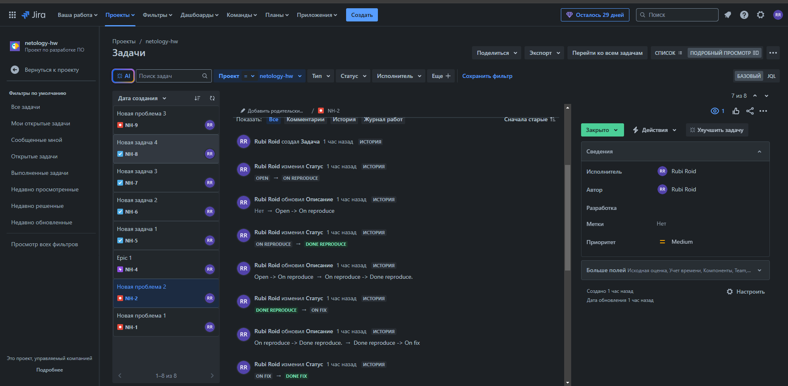
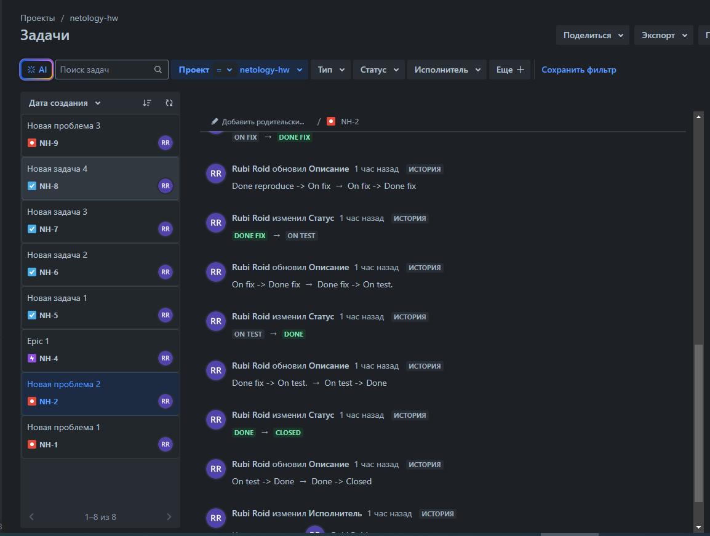

## Задача 2-4

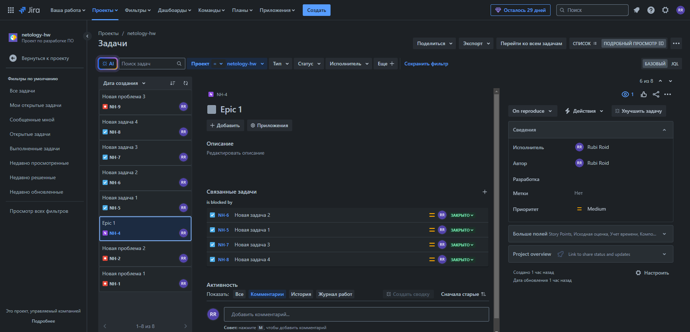
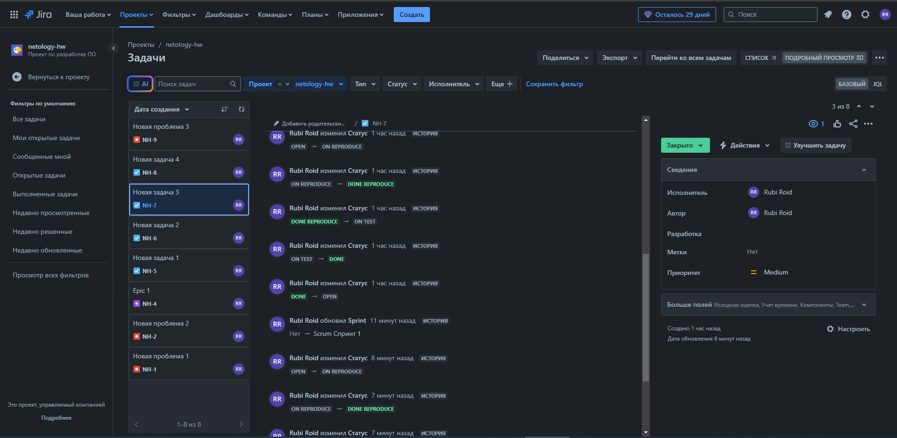
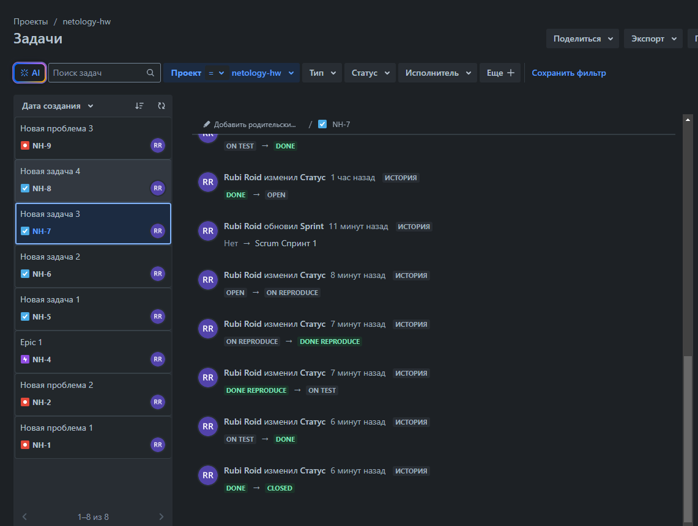

Полный цикл рабочего потока с возвратом обратно в открыто

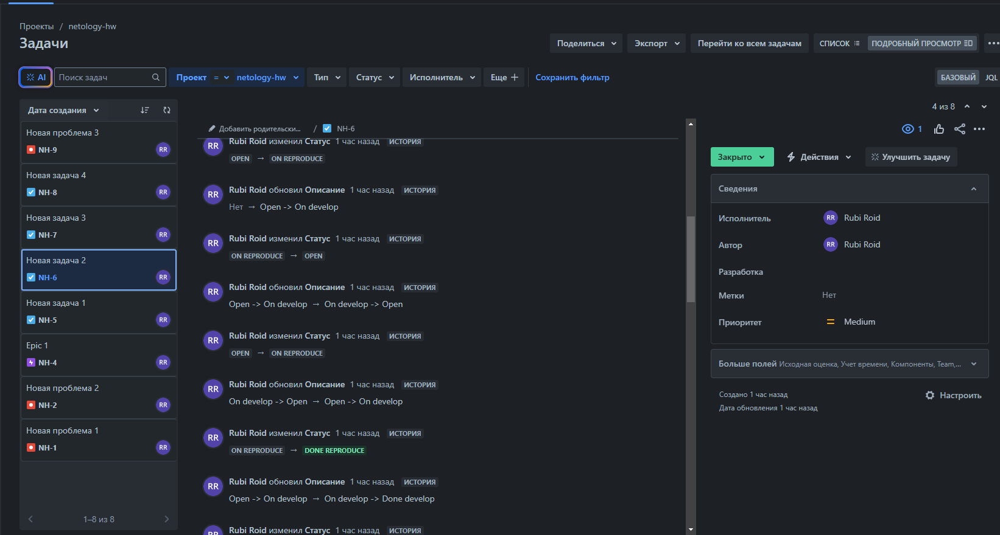
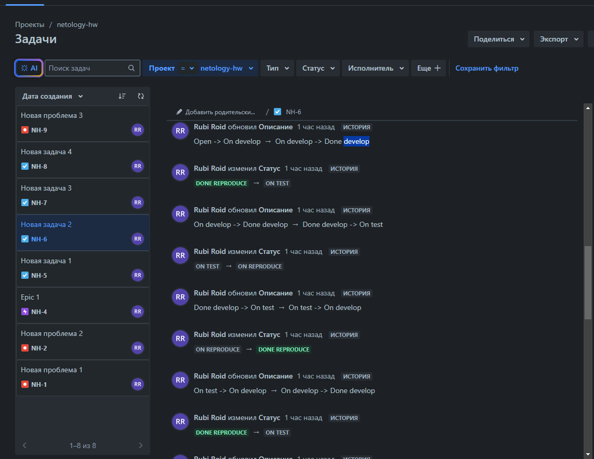
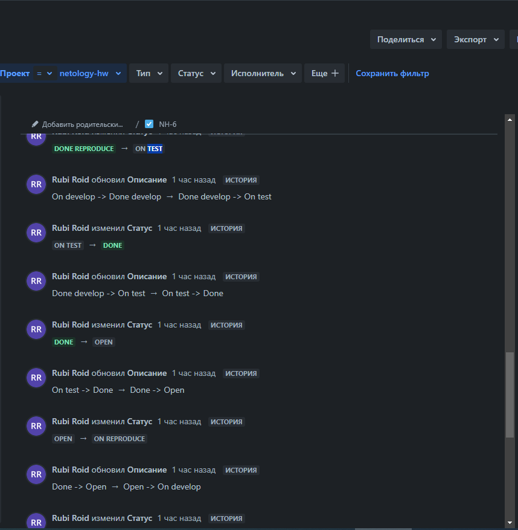
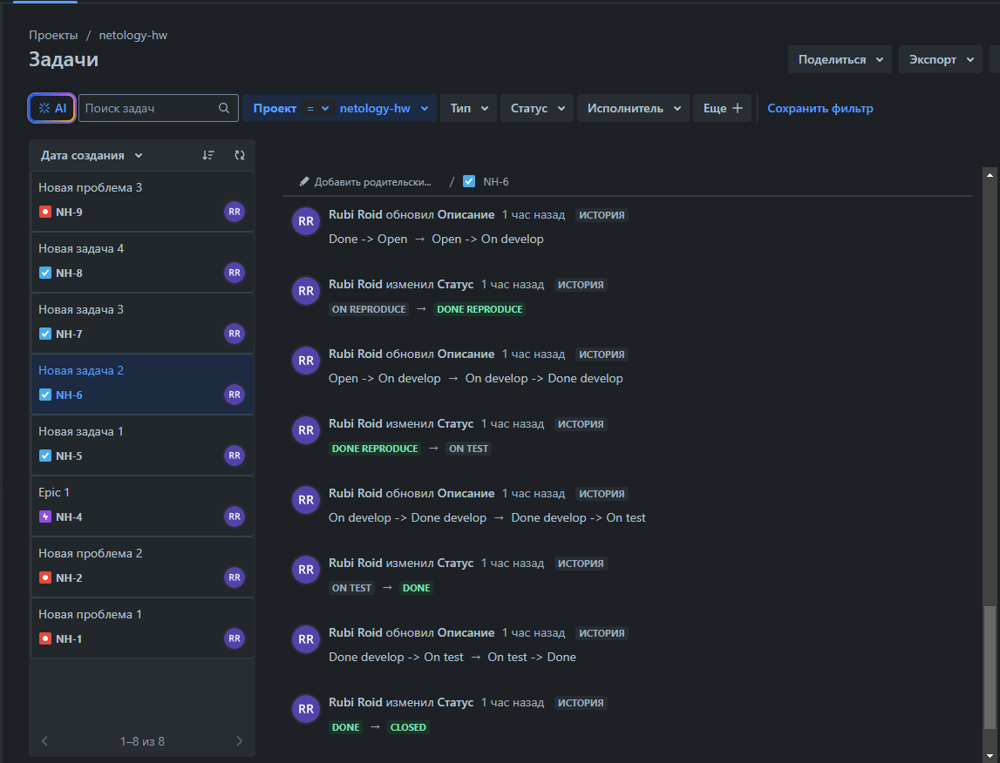

## Задача 5

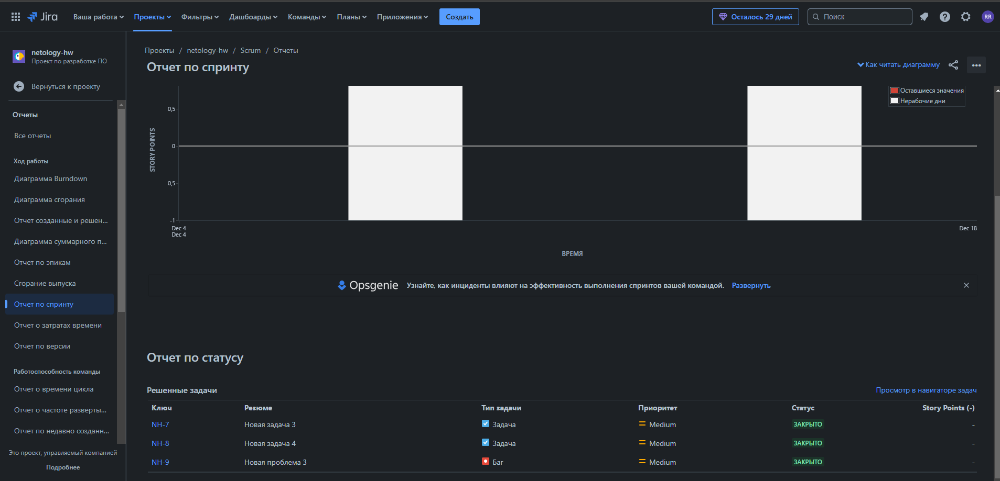

## Задача 6

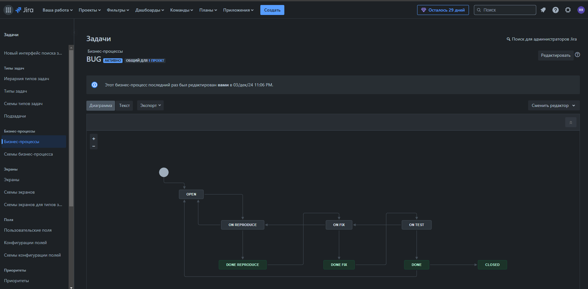

[BUG.xml](BUG.xml)

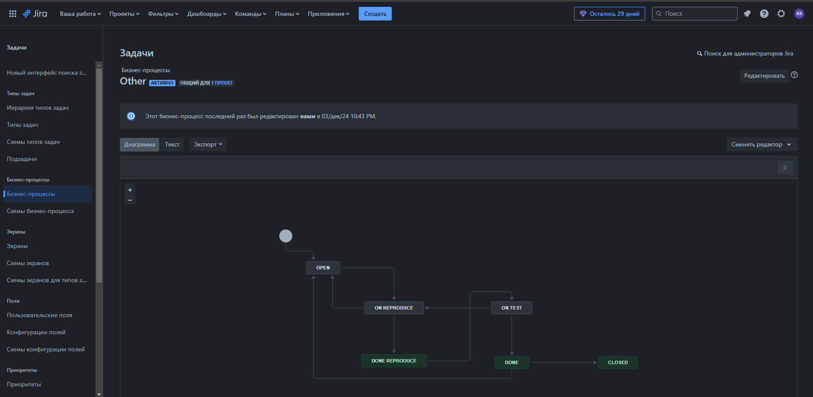

[Other.xml](Other.xml)
