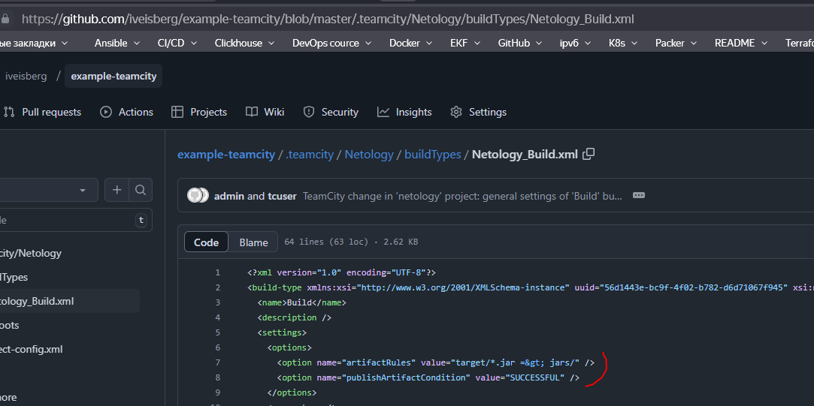

Домашнее задание к занятию 11 «Teamcity»

Подготовка к выполнению

Виртуальные машины:

Добавил агент

Развернул Nexus

## Задача 1-3

## Задача 4

## Задача 5

## Задача 6

## Задача 7

## Задача 8

https://github.com/iveisberg/example-teamcity/tree/master/.teamcity/Netology

## Задача 9-12

https://github.com/iveisberg/example-teamcity/blob/feature/add_reply/src/main/java/plaindoll/Welcomer.java

https://github.com/iveisberg/example-teamcity/blob/feature/add_reply/src/test/java/plaindoll/WelcomerTest.java

## Задача 13

До этого был неверно указан шаг в сборке(вместо test было тоже deploy) ниже на скрине поправил 

внес обратно изменения в пом файл по версии приложения и все тесты прошли успешно

## Задача 14

https://github.com/iveisberg/example-teamcity/pull/2/commits

## Задача 15

Артефакта нет

## Задача 16

## Задача 17

## Задача 18

Изменения содержит самые последние

