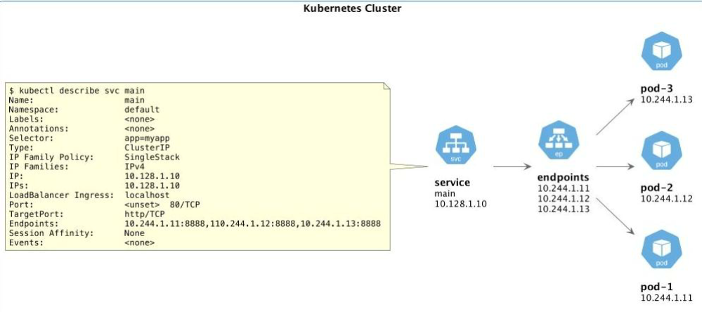

### Инструкция к заданию

1. Установка MicroK8S:
    - sudo apt update,
    - sudo apt install snapd,
    - sudo snap install microk8s --classic,
    - добавить локального пользователя в группу `sudo usermod -a -G microk8s $USER`,
    - изменить права на папку с конфигурацией `sudo chown -f -R $USER ~/.kube`.

2. Полезные команды:
    - проверить статус `microk8s status --wait-ready`;
    - подключиться к microK8s и получить информацию можно через команду `microk8s command`, например, `microk8s kubectl get nodes`;
    - включить addon можно через команду `microk8s enable`; 
    - список addon `microk8s status`;
    - вывод конфигурации `microk8s config`;
    - проброс порта для подключения локально `microk8s kubectl port-forward -n kube-system service/kubernetes-dashboard 10443:443`.

3. Настройка внешнего подключения:
    - отредактировать файл /var/snap/microk8s/current/certs/csr.conf.template
    ```shell
    # [ alt_names ]
    # Add
    # IP.4 = 123.45.67.89
    ```
    - обновить сертификаты `sudo microk8s refresh-certs --cert front-proxy-client.crt`.

4. Установка kubectl:
    - curl -LO https://storage.googleapis.com/kubernetes-release/release/`curl -s https://storage.googleapis.com/kubernetes-release/release/stable.txt`/bin/linux/amd64/kubectl;
    - chmod +x ./kubectl;
    - sudo mv ./kubectl /usr/local/bin/kubectl;
    - настройка автодополнения в текущую сессию `bash source <(kubectl completion bash)`;
    - добавление автодополнения в командную оболочку bash `echo "source <(kubectl completion bash)" >> ~/.bashrc`.

------

### Инструменты и дополнительные материалы, которые пригодятся для выполнения задания

1. [Инструкция](https://microk8s.io/docs/getting-started) по установке MicroK8S.
2. [Инструкция](https://kubernetes.io/ru/docs/reference/kubectl/cheatsheet/#bash) по установке автодополнения **kubectl**.
3. [Шпаргалка](https://kubernetes.io/ru/docs/reference/kubectl/cheatsheet/) по **kubectl**.


### Для настройки доступа к Kubernetes Dashboard в MicroK8s и получения к нему доступа извне по белому адресу выполните следующие шаги:

1. **Установка Dashboard**:
   - Убедитесь, что Dashboard включен:
     ```bash
     microk8s enable dashboard
     ```

2. **Получение токена доступа**:
   - Для версий MicroK8s 1.24 и новее:
     ```bash
     microk8s kubectl create token default
     ```
   - Для версий MicroK8s 1.23 и старше:
     ```bash
     token=$(microk8s kubectl -n kube-system get secret | grep default-token | cut -d " " -f1)
     microk8s kubectl -n kube-system describe secret $token
     ```

3. **Настройка RBAC (если необходимо)**:
   - Создайте пользователя с ограниченными правами, следуя документации по управлению доступом Kubernetes Dashboard.

4. **Перенаправление порта**:
   - Для того чтобы получить доступ к Dashboard извне, используйте команду:
     ```bash
     microk8s kubectl port-forward -n kube-system service/kubernetes-dashboard 10443:443 --address 0.0.0.0 (лучше свой белый)
     ```
   - Теперь вы можете открыть в браузере адрес: `https://127.0.0.1:10443` или `https://<IP_адрес_ВМ>:10443`.

5. **Доступ к Dashboard по белому адресу**:
   - Если MicroK8s установлен на виртуальной машине, используйте команду с указанием адреса:
     ```bash
     multipass exec MicroK8sVM -- sudo /snap/bin/microk8s kubectl port-forward -n kube-system service/kubernetes-dashboard 10443:443 --address 0.0.0.0
     ```
   - Получите IP-адрес виртуальной машины:
     ```bash
     multipass info MicroK8sVM | grep IPv4 | awk '{ print $2 }'
     ```
   - Откройте в браузере адрес: `https://<IP_адрес_ВМ>:10443`.

Эти шаги помогут вам настроить доступ к Kubernetes Dashboard в MicroK8s и получить доступ к нему извне по белому адресу.


### Команды для работы с конфигом (kubectl config)

- Список кластеров
`kubectl config get-clusters`

- Список пользователей
`kubectl config get-users`

- Список контекстов
`kubectl config get-contexts`

- Текущий контекст
`kubectl config current-context`

- Переключение текущего контекста
`kubectl config use-context name`

- Установка доступов
`kubectl config set-credentials`


### Получение информации о ресурсе кластера

- Получение информации о всех нодах кластера
`kubectl get nodes`

- Получение дополнительной информации о всех нодах кластера
`kubectl get nodes -o wide`

- Получение детальной информации о конкретной ноде
`kubectl describe nodes node_name`


#### Декларативная конфигурация объекта:
`kubectl apply -f config_nginx.yaml`

#### Особенности Labels
`kubectl label pod pod-with-app app=myapp`

#### Особенности селекторов
Есть два типа селекторов:
- на равенстве — позволяют отфильтровывать объекты по ключам и значениям меток
- на наборе — фильтруют ключи в соответствии с набором значений

```yaml
apiVersion: v1 
kind: Service 
metadata:
name: pod-with-app-service
spec:
Selector: 
app: myapp
ports:
- name: web 
port: 80
```

#### Service обеспечивает сетевую связность
Service обладает постоянным IP-адресом и DNS-именем, которые можно связать с 
подом или подами.

`kubectl get svc`

#### Endpoints объединяет сервис с подами
Цепочка событий выглядит так: Service —> Endpoints —> Pod

Endpoints объединяет сервис с подами по селекторам, которые указаны в спецификации сервиса
- Если для сервиса указан селектор, то объект Endpoints будет создан автоматически
- Можно создать вручную, указав IP-адрес
- Имя сервиса и имя Endpoints должны совпадать




#### Подключение с помощью kubectl port-forward

Нужно переадресовать один или несколько локальных портов в ресурс K8s

- Подключиться можно напрямую к поду, либо к сервису
- Команда kubectl port-forward не возвращает значение
- Команда может быть применена на разные ресурсы

`kubectl port-forward`


#### Применение манифеста:
создать Pod:

```bash
kubectl apply -f hello-world-pod.yaml
```

```bash
kubectl get pods
   ```

#### Подключение через port-forward:
подключиться к Pod из локальной среды:

```bash
kubectl port-forward pod/hello-world 8080:8080
```

```bash
curl http://localhost:8080
```

#### Создать Service:

```bash
kubectl apply -f netology-svc.yaml
```

```bash
kubectl get pods
kubectl get services
```

#### Добавление метки к Pod:
Чтобы Service мог находить Pod, добавить метку к Pod:

```bash
kubectl label pod netology-web app=netology-web
```

#### Подключение через port-forward к Service:
Теперь вы можете подключиться к Service из локальной среды:

```bash
kubectl port-forward service/netology-svc 8080:80
```


