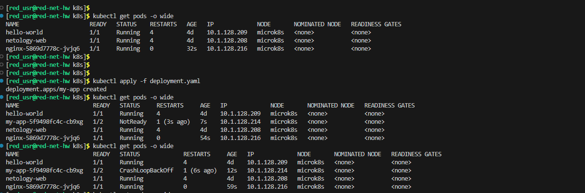
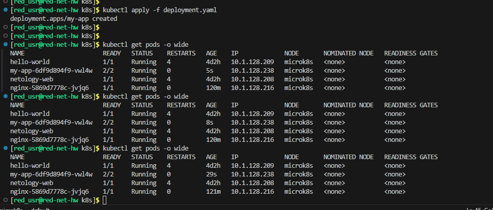
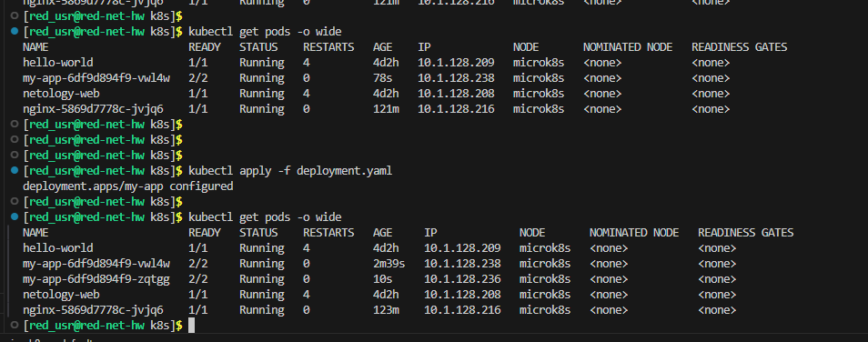
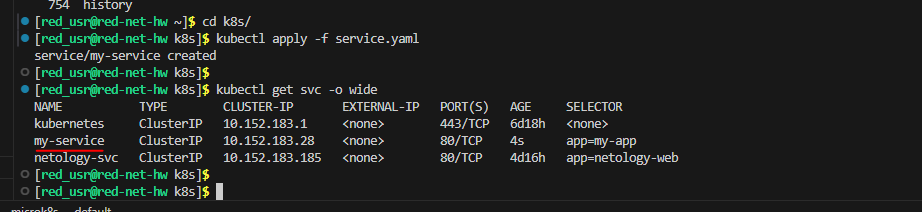
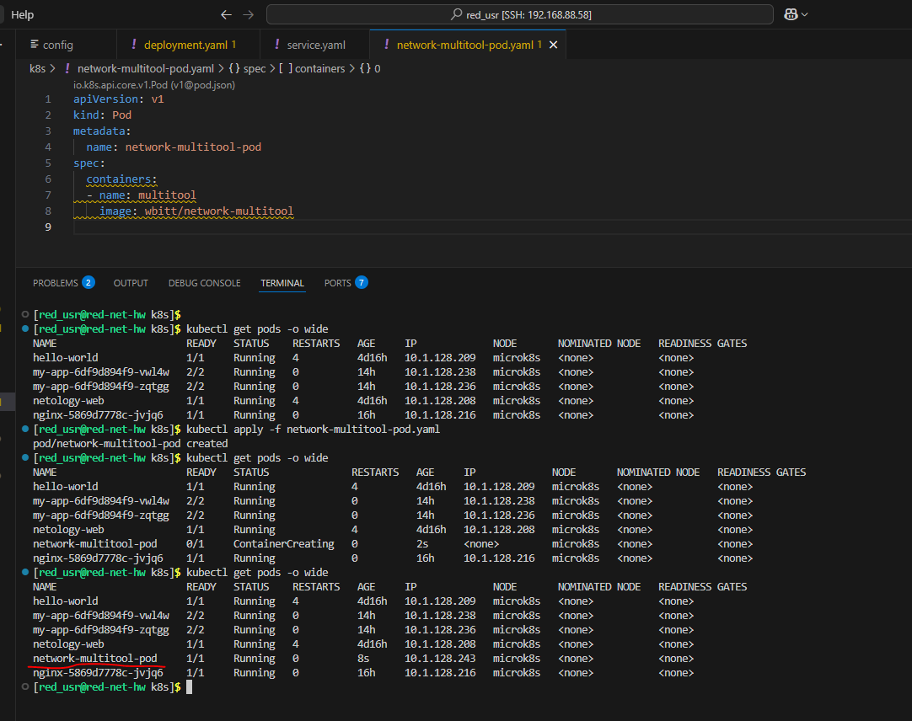
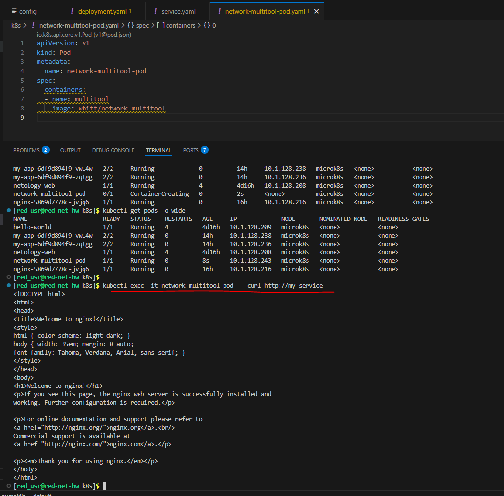
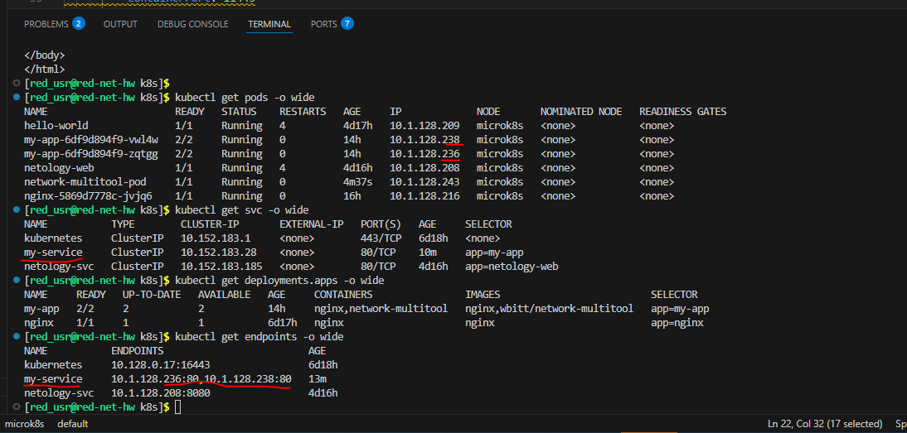
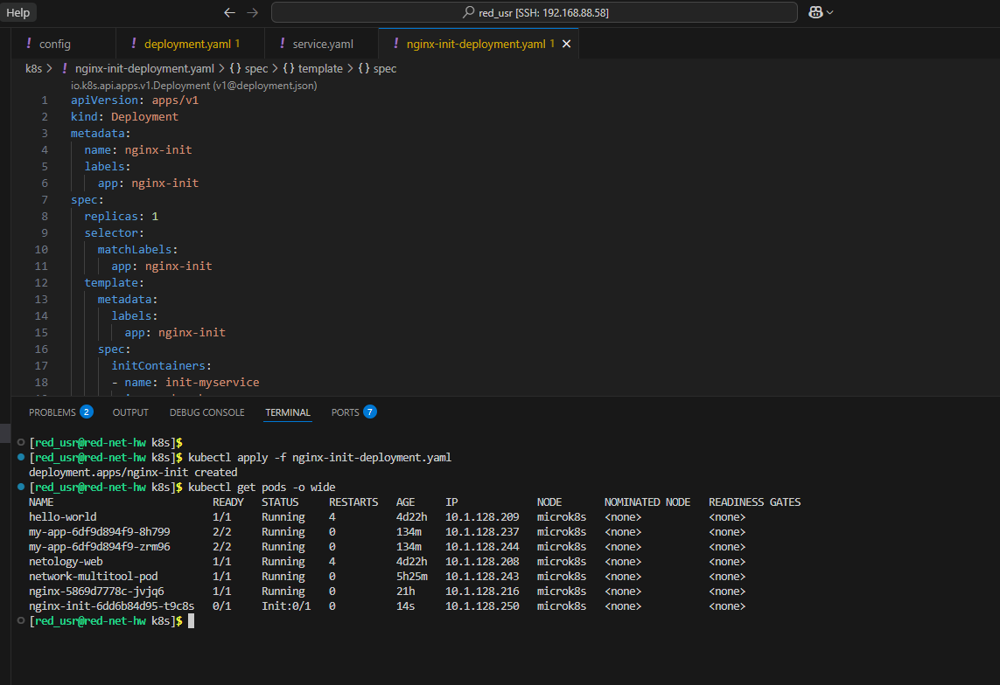
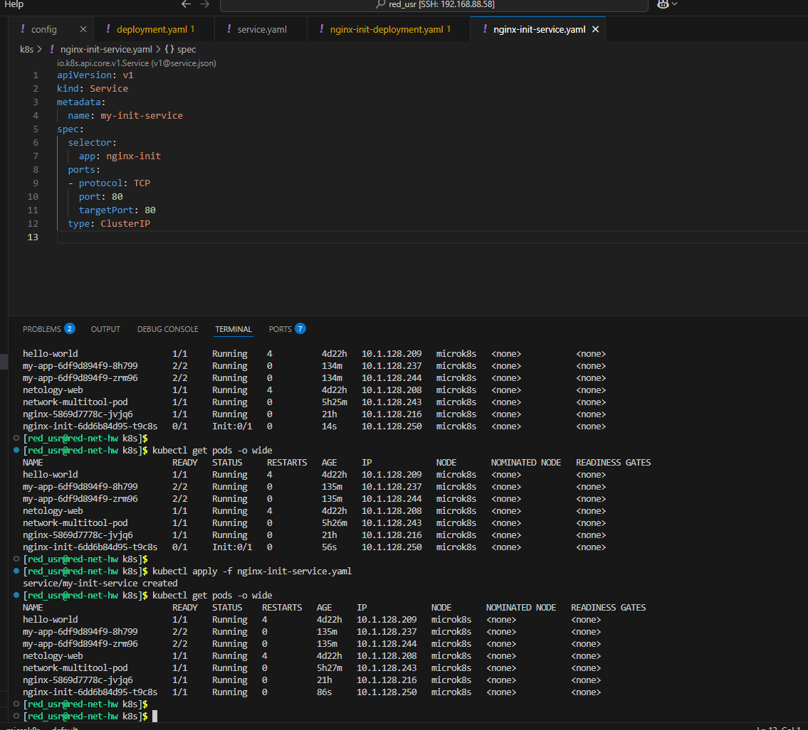
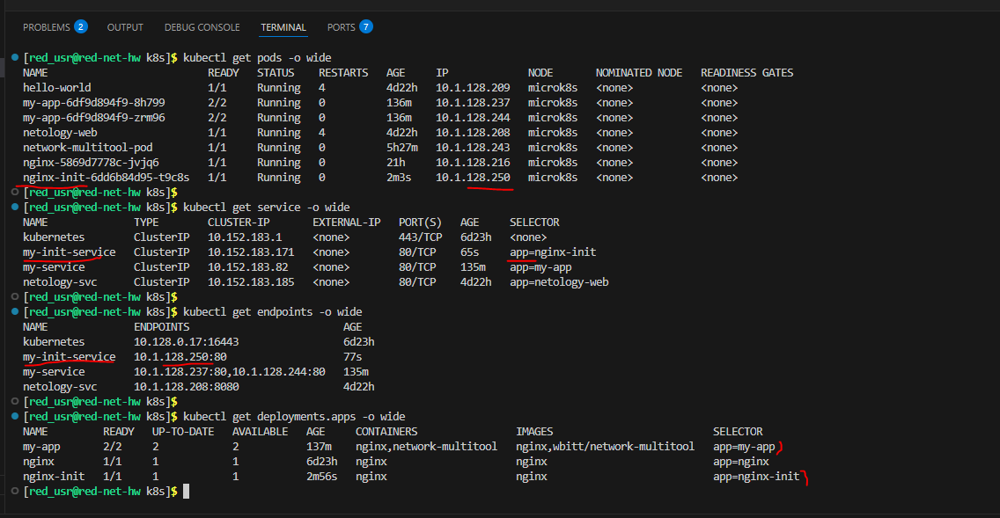

Домашнее задание к занятию «Запуск приложений в K8S»

Обязательные задания

## Задание 1. Создать Deployment и обеспечить доступ к репликам приложения из другого Pod

- 1

[deployment.yaml](deployment.yaml)

- 2-3

- 4

[service.yaml](service.yaml)

- 5

[network-multitool-pod.yaml](Homework_for_lesson_3.md)

## Задание 2. Создать Deployment и обеспечить старт основного контейнера при выполнении условий

- 1-2

[nginx-init-deployment.yaml](nginx-init-deployment.yaml)

- 3-4

[nginx-init-service.yaml](nginx-init-service.yaml)

