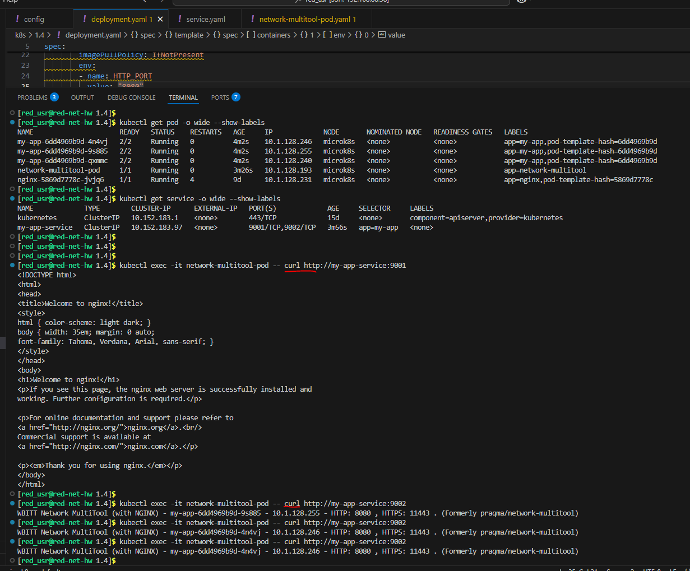
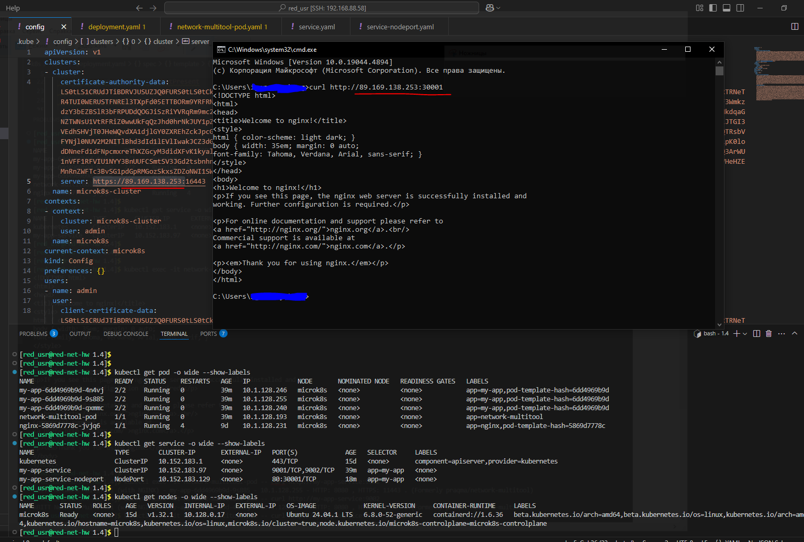

Домашнее задание к занятию «Сетевое взаимодействие в K8S. Часть 1»

Обязательные задания

## Задание 1. Создать Deployment и обеспечить доступ к контейнерам приложения по разным портам из другого Pod внутри кластера

## Задание 2. Создать Service и обеспечить доступ к приложениям снаружи кластера

[deployment.yaml](deployment.yaml)

[service.yaml](service.yaml)

[network-multitool-pod.yaml](network-multitool-pod.yaml)

[service-nodeport.yaml](service-nodeport.yaml)
