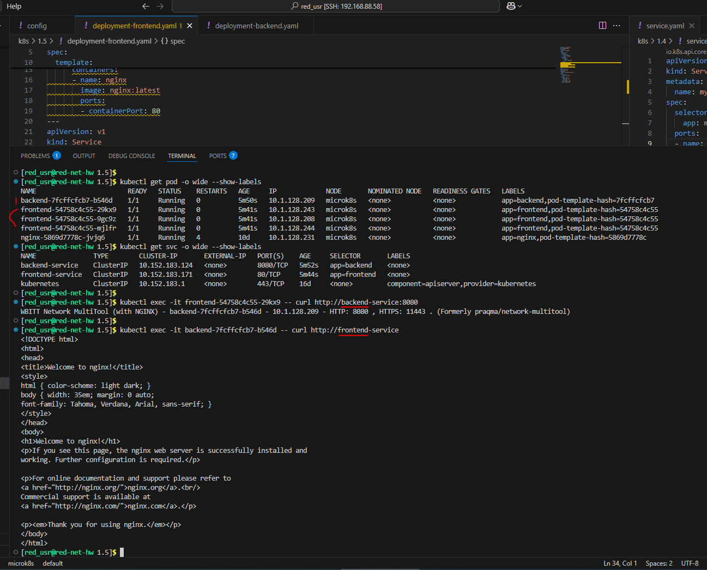
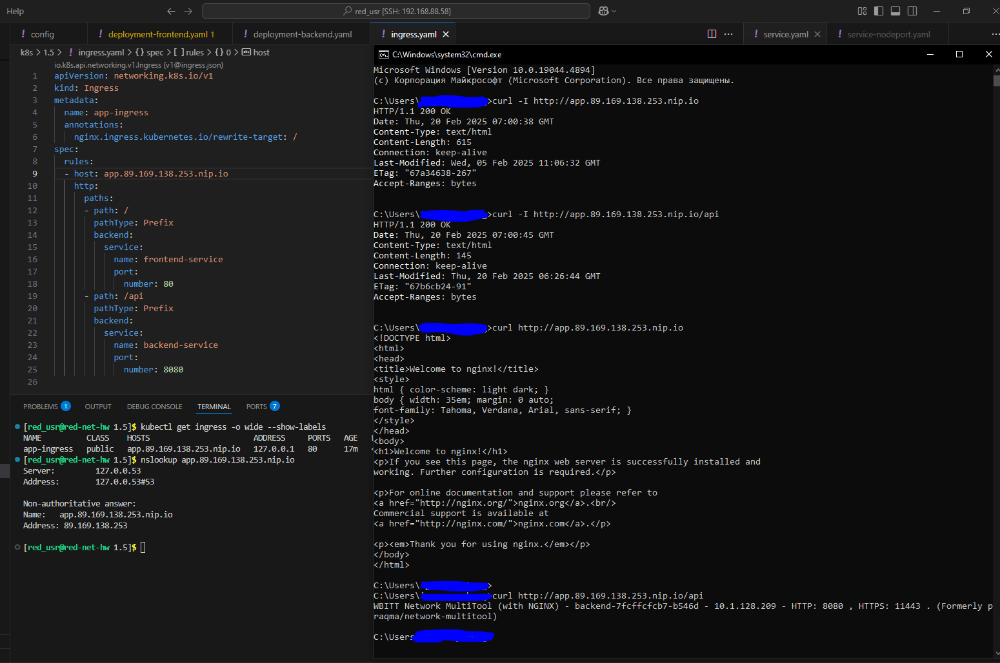

Домашнее задание к занятию «Сетевое взаимодействие в K8S. Часть 2»

Обязательные задания

## Задание 1. Создать Deployment приложений backend и frontend

## Задание 2. Создать Ingress и обеспечить доступ к приложениям снаружи кластера

### Манифесты:

[deployment-frontend.yaml](deployment-frontend.yaml)

[deployment-backend.yaml](deployment-backend.yaml)

[ingress.yaml](ingress.yaml)
