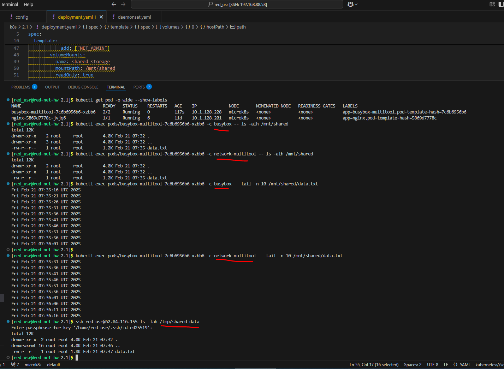
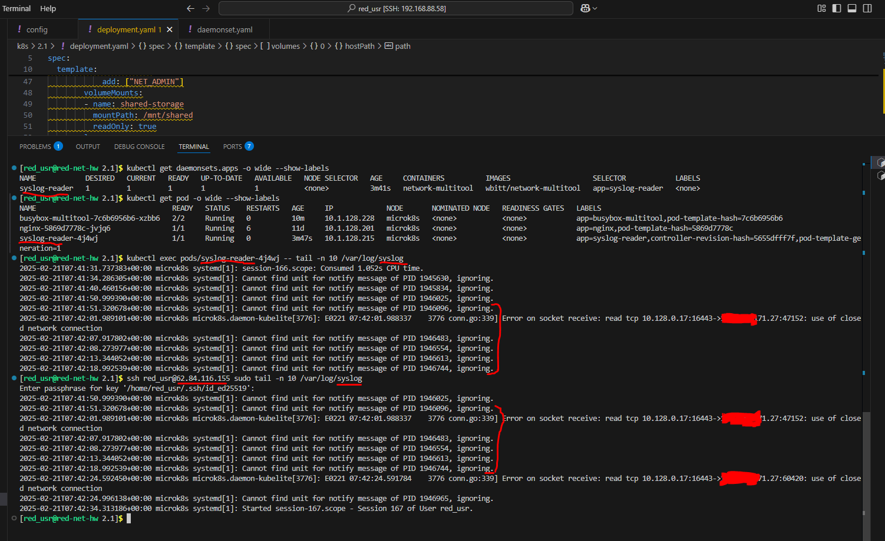

Домашнее задание к занятию «Хранение в K8s. Часть 1»

Обязательные задания

## Задание 1. Создать Deployment приложения, состоящего из двух контейнеров и обменивающихся данными.

## Задание 2. Создать DaemonSet приложения, которое может прочитать логи ноды.

### Манифесты:

[deployment.yaml](deployment.yaml)

[daemonset.yaml](daemonset.yaml)
