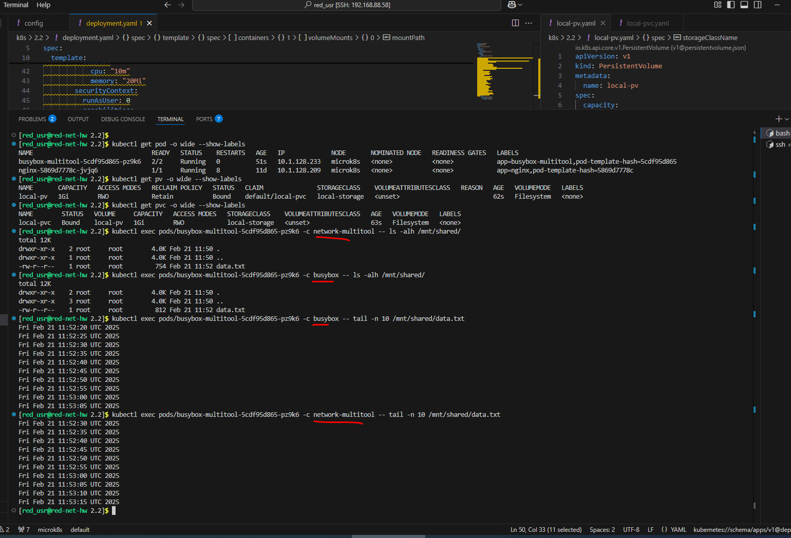
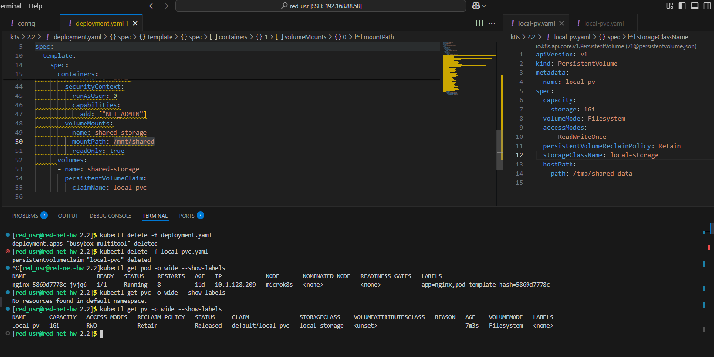
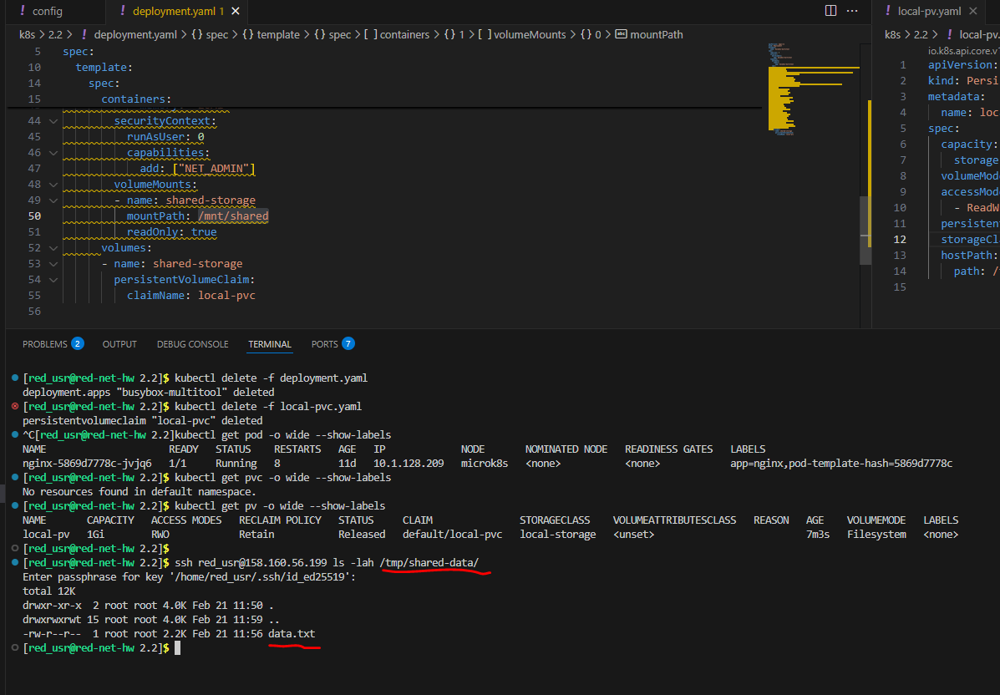
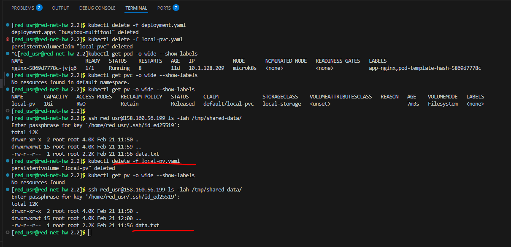
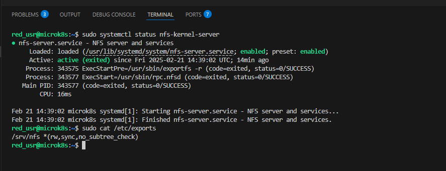
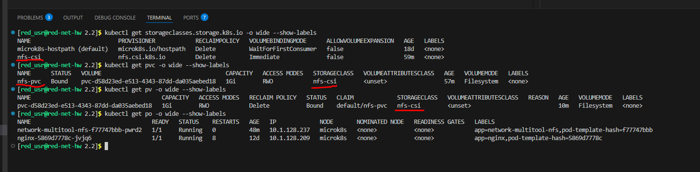
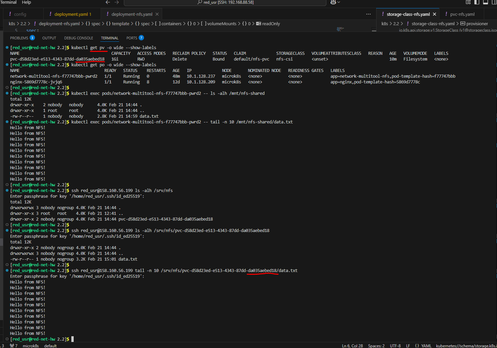

Домашнее задание к занятию «Хранение в K8s. Часть 2»

Обязательные задания

## Задание 1. Создать Deployment приложения, использующего локальный PV, созданный вручную.

- 1-2
### Манифесты:

[deployment.yaml](deployment.yaml)

[local-pv.yaml](local-pv.yaml)

[local-pvc.yaml](local-pvc.yaml)

- 3

- 4

После удаления PVC, PV остается в статусе “Released”, потому что его данные могут быть использованы снова, но PVC не ссылается на него.

- 5

После удаления PV, файл data.txt остается на локальном диске, так как PV использует hostPath, и удаление PV не приведет к удалению данных на диске.

## Задание 2. Создать Deployment приложения, которое может хранить файлы на NFS с динамическим созданием PV.

- 1

- 2

- 3

### Манифесты:

[deployment-nfs.yaml](deployment-nfs.yaml)

[storage-class-nfs.yaml](storage-class-nfs.yaml)

[pvc-nfs.yaml](pvc-nfs.yaml)
