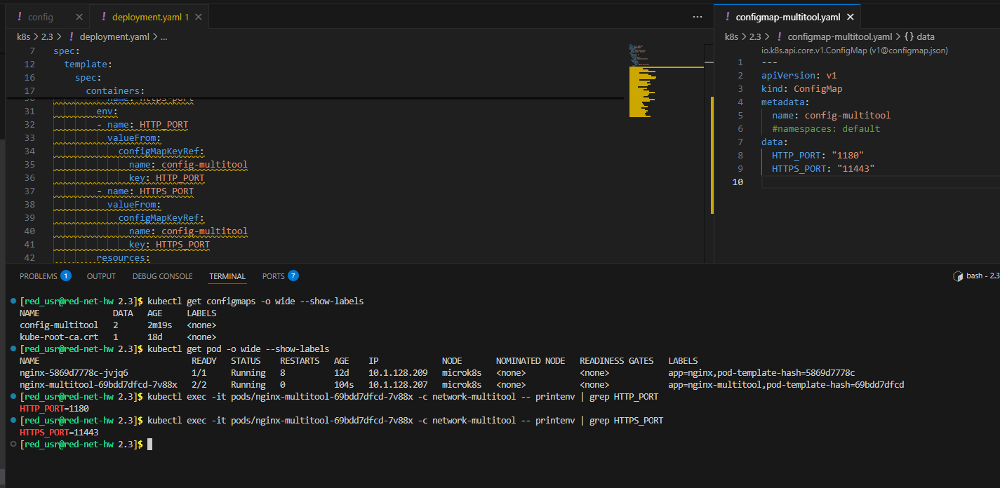
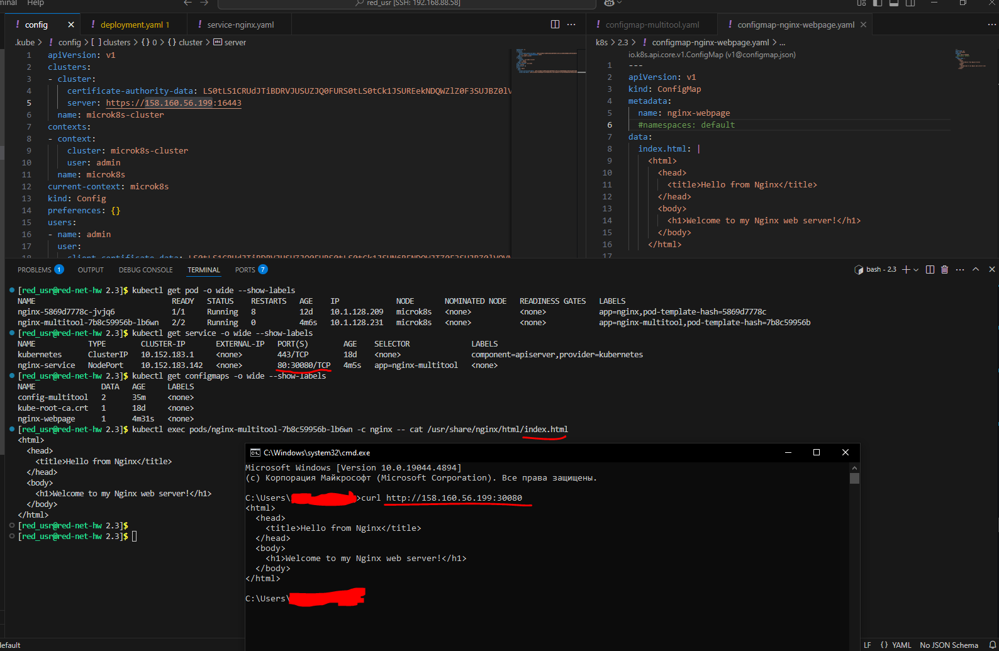
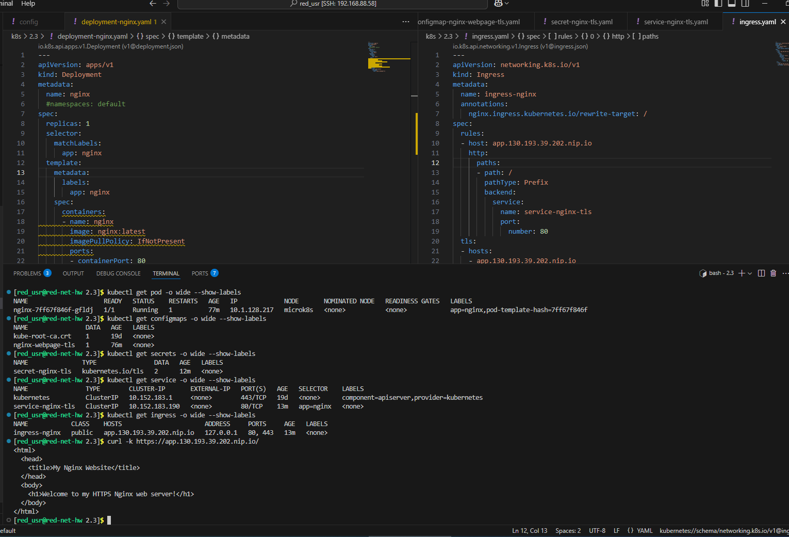
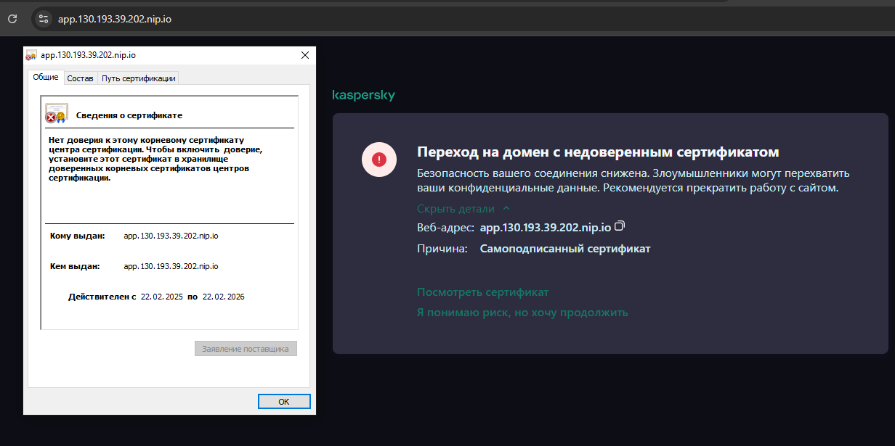
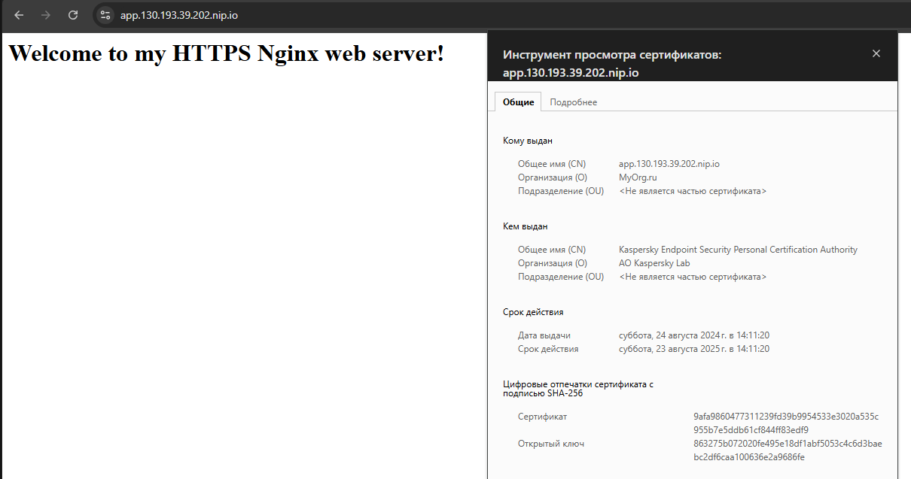

Домашнее задание к занятию «Конфигурация приложений»

Обязательные задания

## Задание 1. Создать Deployment приложения и решить возникшую проблему с помощью ConfigMap. Добавить веб-страницу

- 1-3

### Манифесты:

[configmap-multitool.yaml](configmap-multitool.yaml)

- 4-5

### Манифесты:

[configmap-nginx-webpage.yaml](configmap-nginx-webpage.yaml)

[deployment.yaml](deployment.yaml)

[service-nginx.yaml](service-nginx.yaml)

## Задание 2. Создать приложение с вашей веб-страницей, доступной по HTTPS

- 1

[deployment-nginx.yaml](deployment-nginx.yaml)

- 2

[configmap-nginx-webpage-tls.yaml](configmap-nginx-webpage-tls.yaml)

- 3

[secret-nginx-tls.yaml](secret-nginx-tls.yaml)

- 4-5

### Манифесты:

[ingress.yaml](ingress.yaml)

[service-nginx-tls.yaml](service-nginx-tls.yaml)
