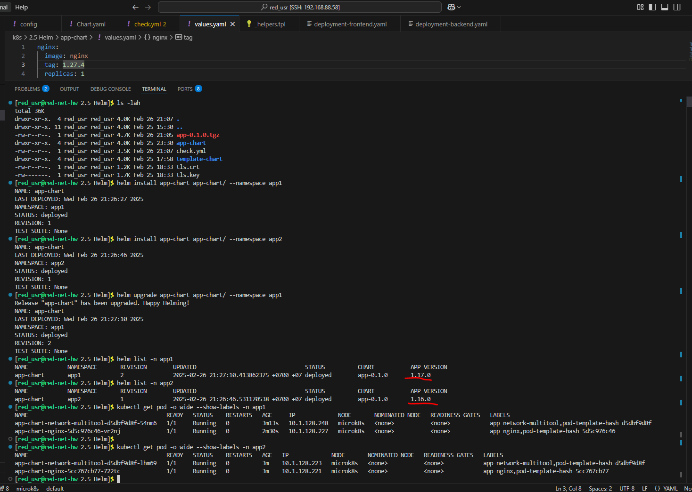
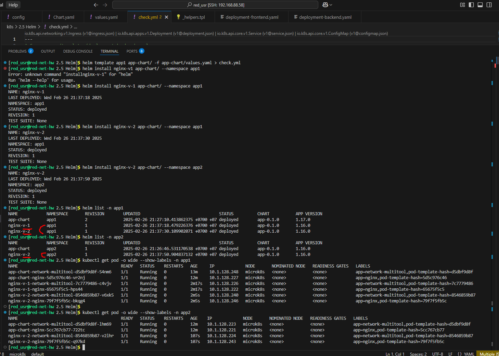

Домашнее задание к занятию «Управление доступом»

Обязательные задания

## Задание 1. Подготовить Helm-чарт для приложения

## Задание 2. Запустить две версии в разных неймспейсах

### Chart:

[app-chart](app-chart)
