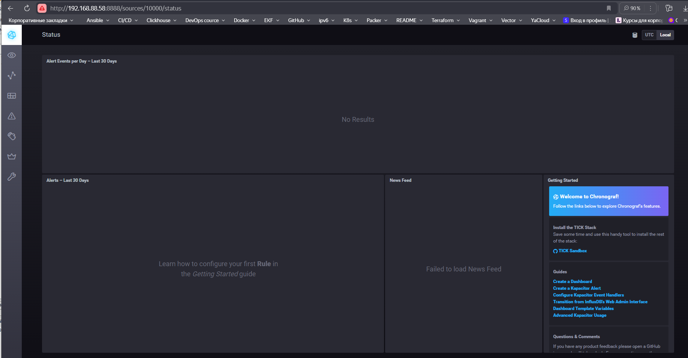
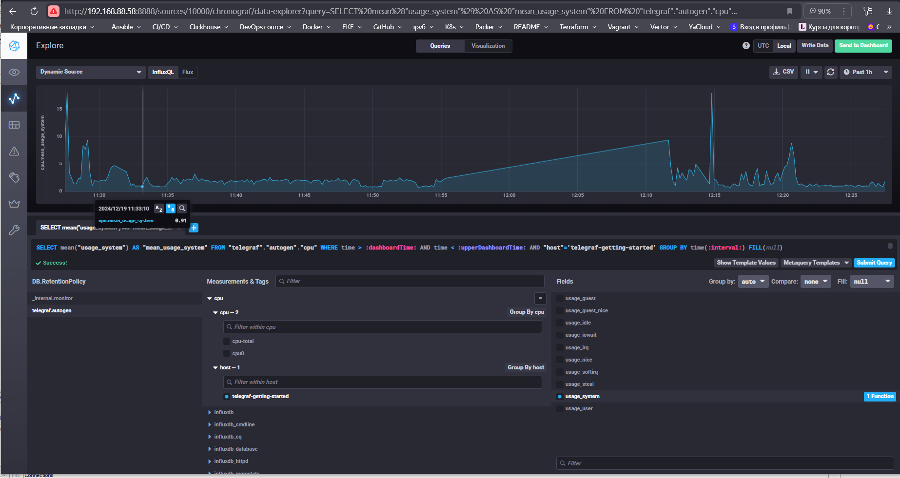
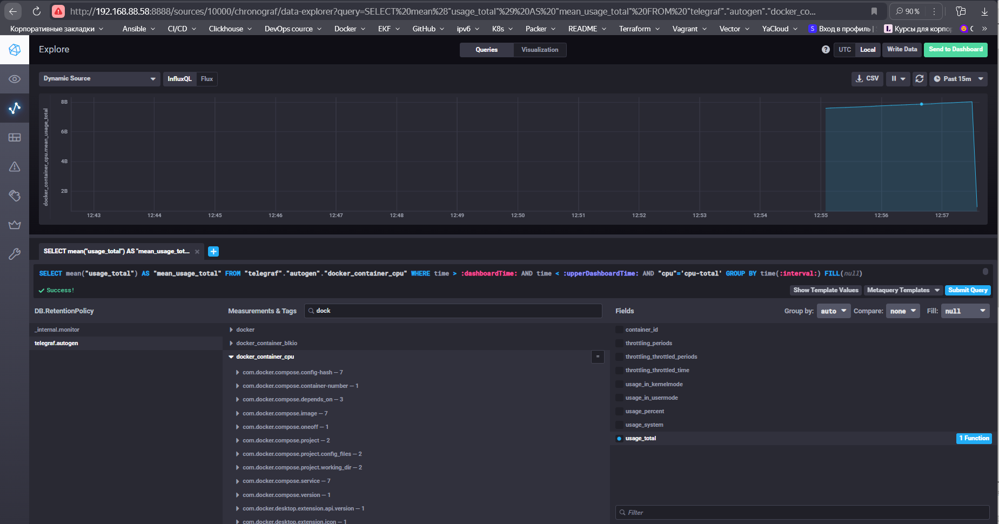

Домашнее задание к занятию "13.Системы мониторинга"

Обязательные задания

## Задача 1. Минимальный набор метрик для мониторинга

Для мониторинга платформы для вычислений с выдачей текстовых отчетов я бы предложил следующий минимальный набор метрик:

- **Загрузка CPU**: Поскольку вычисления нагружают CPU, важно отслеживать его загрузку, чтобы понимать, насколько система загружена и не испытывает ли она перегрузки.
- **Задержки обработки HTTP-запросов**: Это позволит оценить производительность вашего сервиса. Можно мониторить среднее время ответа и 95-процентиль.
- **Количество обработанных запросов**: Эта метрика позволяет понимать нагрузку на сервис и загруженность системы.
- **Использование диска (disk I/O)**: Важно следить за использованием диска, поскольку отчеты сохраняются на диске, и диск может стать узким местом.
- **Количество завершенных вычислений / успешных отчетов**: Это даст представление о том, насколько эффективно выполняются операции и генерируются отчеты.

## Задача 2. Понятные метрики для менеджера продукта

Разбор каждой из упомянутых метрик:

### 1. RAM (Random Access Memory)
RAM - это оперативная память, которая используется компьютерами и серверами для временного хранения данных и инструкций, необходимых для выполнения текущих программ и задач. Когда вы запускаете приложение, оно загружает свою часть кода и данные в RAM, чтобы обеспечить высокую скорость доступа. 

Показатели использования RAM важны, так как недостаток оперативной памяти может привести к снижению производительности, например, к замедлению работы программ или их завершению.

### 2. Inodes
Inodes - это структуры данных, которые хранят информацию о файлах в файловой системе UNIX и UNIX-подобных операционных системах (таких как Linux). Каждый файл и каталог на диске имеет свой inode, который содержит метаданные о файле, такие как его размер, права доступа, временные метки и расположение фактических данных.

Количество inodes ограничено размером дискового пространства и типом файловой системы. Если у вас исчерпаны inodes, вы не сможете создать новые файлы, даже если на диске останется место.

### 3. CPUla (CPU Load Average)
CPU load average (средняя загрузка CPU) - это метрика, которая показывает количество процессов, ожидающих выполнения на процессоре в среднем за последнюю 1, 5 и 15 минут. Она отражает общую нагрузку на CPU и может помочь вам понять, насколько загружена ваша система.

Значение CPU load average:
- Значение ниже числа доступных CPU указывает на то, что система, скорее всего, не перегружена.
- Значение, значительно превышающее количество доступных CPU, сигнализирует о том, что система может быть перегружена, и некоторые процессы могут ожидать выполнения.

### Понимание для менеджера продукта
Менеджер продукта, не обладая техническими знаниями, может не понимать, что означают эти метрики, поэтому важно представить их так, чтобы они были более связаны с бизнес-показателями. Например,:

- Использование RAM можно связать с производительностью сервисов, а мы можем говорить о хорошей работе как о "отсутствии задержек в обработке запросов".
- Inodes можно описать как "максимальное количество файлов или отчетов, которые мы можем сохранить на диске", что важно для хранения отчетов.
- Загрузка CPU следует связывать с производительностью вычислений и качеством предоставляемых услуг. Если загрузка слишком высока, это может влиять на время ответа системы.

Такой подход поможет руководству лучше понять важность каждой из метрик.

Для того чтобы сделать метрики еще более понятными для менеджера продукта, можно предложить:

- **Время обработки запроса** (response time): Это просто и понятно, и будет отражать качество обслуживания.
- **Процент успешных операций**: Можно вести расчет (например, количество успешно завершенных вычислений на общее количество запросов).
- **Время отклика сервиса**: Это позволит понять, насколько быстро сервис реагирует на запросы.
- **Количество запросов в очереди**: Это может помочь увидеть, если система начинает перегружаться.

## Задача 3. Решение для разработки без финансирования на сбор логов

Если финансирование на сбор логов не выделено, хорошим решением будет использовать встроенные возможности приложений и системы для логирования:

- **Логирование на уровень приложения**: Убедитесь, что ваше приложение имеет встроенное логирование (например, с использованием стандартного логгера). Программисты могут настраивать уровень логирования на "ошибки" (ERROR) и "предупреждения" (WARNING).
- **Отправка ошибок**: Если разработчики используют какие-либо инструменты практически на уровне разработки (например, Sentry или другую аналогичную платформу), они могут настроить отправку информации о возникших ошибках на свою почту или в чат.

## Задача 4. Ошибка в формуле SLA

Если SLA = 99% вычисляется по формуле `summ_2xx_requests/summ_all_requests` и данный параметр не поднимается выше 70% при отсутствии 5xx и 4xx кодов, это может указывать на то, что:

- У вас слишком много запросов, которые не являются 2xx. Это могут быть, например, кодов 3xx (перенаправления), которые не учитываются в вашем расчете. Вам следует дополнить свою систему мониторинга метриками, связанными с 3xx (например, статусные коды 301 и 302).

## Задача 5. Плюсы и минусы pull и push систем мониторинга

**Pull модель:**
- **Плюсы:**
    - Легкость настройки: метрики запрашиваются по расписанию.
    - Сетевой трафик контролируется, так как запрос производится из централизованной точки.
    - Более простой интерфейс API: обычно проще реализовать.
- **Минусы:**
    - Может быть сложно получать данные в реальном времени.
    - Периодические пробелы в данных между опросами.

**Push модель:**
- **Плюсы:**
    - Реальное время: данные сразу отправляются в систему мониторинга.
    - Меньше требований к инфраструктуре запросов.
- **Минусы:**
    - Микросервисы должны иметь код для отправки данных.
    - Может привести к перегрузке сети при частом отправлении данных.

## Задача 6. Классификация систем мониторинга

- **Push модель**:
   - **Prometheus (gRPC endpoints)**: использует pull, но можно реализовать push с помощью Push Gateway.
   - **TICK**: поддерживает push и pull, зависит от конфигурации.
   - **VictoriaMetrics**: в основном pull, но может работать и с push подходом через HTTP API.
  
- **Pull модель**:
   - **Zabbix**: в основном использует pull модель для сбора данных.
   - **Nagios**: в основном pull для мониторинга состояния систем и служб.

Таким образом, все системы имеют свои особенности и могут включать как pull, так и push механизмы, в зависимости от конфигурации и особенностей реализации.

## Задача 7

## Задача 8

