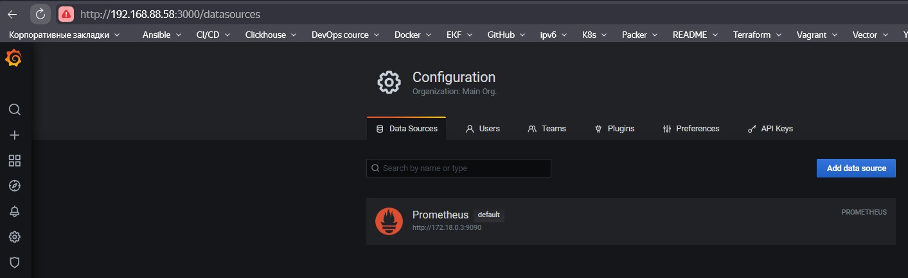
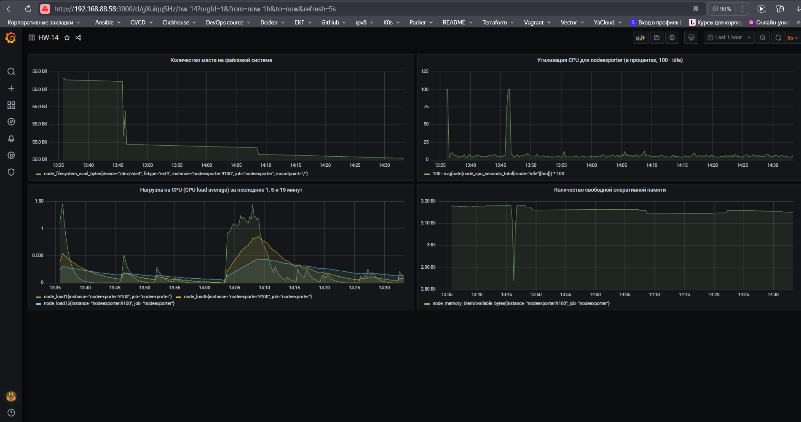
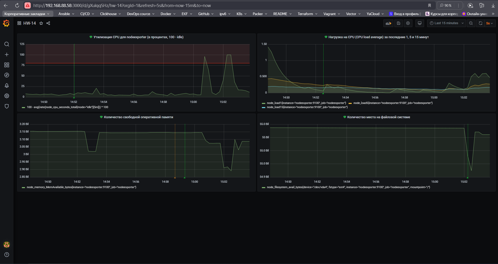

Домашнее задание к занятию 14 «Средство визуализации Grafana»

Обязательные задания

## Задача 1



## Задача 2

Ниже приведены необходимые PromQL-запросы для каждой из метрик:

1. Утилизация CPU для nodeexporter (в процентах, 100 - idle)

```promql
100 - avg(irate(node_cpu_seconds_total{mode="idle"}[5m])) * 100
```
Этот запрос вычисляет процент использования CPU, вычитая процент времени, когда CPU был в неактивном (idle) состоянии.

2. CPULA 1/5/15

```promql
node_load1
node_load5
node_load15
```
Эти метрики отражают среднюю нагрузку на CPU за последние 1, 5 и 15 минут соответственно.

3. Количество свободной оперативной памяти

```promql
node_memory_MemAvailable_bytes
```
Этот запрос возвращает количество доступной оперативной памяти в байтах.

4. Количество места на файловой системе

```promql
node_filesystem_avail_bytes{mountpoint="/"}
```
Этот запрос возвращает количество доступного места на файловой системе для корневого раздела. Если нужно проверить другие разделы или сетевые файловые системы, то меняем значение параметра mountpoint.




## Задача 3




## Задача 4

[JSON Model.json](<JSON Model.json>)
