# Мониторинг - это сбор, обработка, агрегирование и отображение в реальном времени количественных и качественных показателей системы

## Что такое мониторинг
Мониторинг позволяет улучшать или оставлять на приемлемом уровне качество обслуживания пользователей

На практике мониторинг чаще всего включает в себя:
оценку работоспособности ПО
оценку работоспособности оборудования
бизнес-мониторинг
мониторинг безопасности ИС

## Зачем нужен мониторинг
Анализ долгосрочных тенденций — получение качественных характеристик и обеспечение дальнейшей работоспособности системы. Например, размер БД и его близость к критическим значениям
Сравнение версий ПО — насколько изменения ПО повлияли на качество обслуживания
Оповещение — превентивное выявление возможных отклонений в качестве обслуживания и увеличение скорости реакции на сбои
Телеметрия текущей работоспособности приложения — получение текущей оценки характеристик информационной системы в режиме real-time

## Типы мониторинга
Чаще всего мониторинг разделяют на 2 типа:

### White-box monitoring
Наблюдение за системой “изнутри”. Сбор данных профилирования, логов, системные журналы.

### Black-box monitoring
Наблюдение, видимое извне. Например сбор возникших ошибок системы технической поддержкой или отделом тестирования.

Для DevOps-подхода важнее мониторинг white-box, так как только он позволяет спрогнозировать поведение системы и исправить проблемы до их возникновения.
Но про мониторинг black-box тоже не стоит забывать. Это симптоматическая диагностика, которая позволяет выявить редкие кейсы поломок системы

## Деление мониторинга по доменам ответственности
Домены ответственности мониторинга можно разделить по системам сбора метрик:
система сбора временных рядов: Prometheus, InfluxDB, Zabbix
система сбора логов: Elastic Stack, Graylog, Grafana Loki
система «Перехватчик ошибок»: Sentry
система сбора трейсов: Jaeger, Zipkin, OpenTelemetry

Системы сбора временных рядов позволяют получать телеметрию в режиме реального времени и хранить данные в таблицах в виде «метка времени — значение».
Такие системы нужны, чтобы непрерывно наблюдать за изменениями в работоспособности системы.
Пример метрики — доступное место на файловой системе

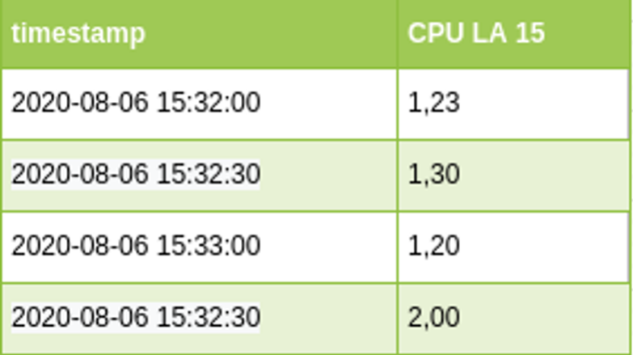

Основные метрики для мониторинга в системах временных рядов:
CPU LA
RAM/swap
IOPS
inodes
FS

Дополнительные метрики для мониторинга в системах временных рядов:
Process liveness
IOwait
NetTraffic
Custom?

Системы сбора логов позволяют агрегировать логи приложений, системные журналы и т. п.
Такие системы чаще всего нужны для детального разбора появившихся проблем, нахождения их частоты появления, разбора поведения системы в каких-то условиях.
Пример — логи балансировщика запросов

Система «Перехватчик ошибок» позволяет информировать о возникающих ошибках ПО в режиме real-time

Для системы можно указать дополнительные характеристики, которые будут в информировании:
слой (stage/production)
hostname
номер реплики приложения
внутреннее состояние приложения

Основные метрики для мониторинга в системах сбора логов и ловли ошибок:
Good events / All events
Traffic

Системы сбора трейсов позволяют собирать и отображать весь путь прохождения клиентского запроса

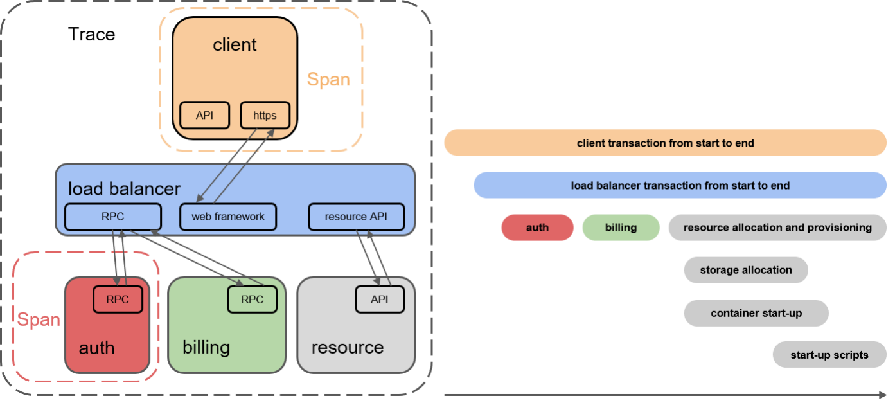

## Подходы при настройке мониторинга
Приведённые подходы не являются формальными и не будут тем самым «золотым молотком», который решит все проблемы.
Но желательно эти подходы знать и использовать при необходимости.
Они позволяют экономить на ресурсах, выделенных для мониторинга, связать мониторинг с бизнес-частью и улучшить качественную интерпретацию полученных метрик

SLO — целевой уровень качества обслуживания. Целевое значение или диапазон значений
SLA — соглашение об уровне обслуживания. Явный или неявный контракт с внешними пользователями, включающий в себя последствия невыполнения SLO
SLI — индикатор качества обслуживания. Конкретная величина предоставляемого обслуживания

Метрики SLO, SLA и SLI позволяют связать измеряемые технические значения с бизнес-составляющей.

Пример простого SLA
Если наш сайт отдаёт HTTP-коды 4хх/5xx, то мы должны произвести денежную компенсацию пользователю, если это не запланированное техническое обслуживание.
Пример SLO
В 99 % случаев мы должны отдавать HTTP-коды, отличные от 4xx/5xx. 
1 % выделяется на техническое обслуживание.
Расчёт SLI может выглядеть таким образом:
SLI = (summ_2xx_requests + summ_3xx_requests) / (summ_all_requests)

### Подходы при настройке мониторинга: SRE
Подход SRE разработал Google, он повсеместно внедряется в компаниях по всему миру.
SRE покрывает большинство задач DevOps, в том числе задачи мониторинга.
Один из его главных плюсов — он сделан практикующими инженерами для практикующих инженеров на основе многолетнего опыта


Основные тезисы подхода при настройке мониторинга:
ставьте для мониторинга реальные задачи
система мониторинга должна отвечать на два вопроса «Что сломалось?» и «Почему сломалось?»
используйте четыре золотых сигнала
не исследуйте только средние значения
выберите подходящий уровень детализации

Четырьмя золотыми сигналами в подходе SRE называются:

Время отклика. Время, которое требуется для выполнения запроса.
Величина трафика. Величина нагрузки, которая приходится на вашу систему. Например для веб - это количество http запросов, а для потокового аудио - это скорость передачи данных.
Уровень ошибок. Количество или частота неуспешно выполненных запросов. Например ответ 500 от http сервера.
Степень загруженности. Показатель того, насколько полно загружен ваш сервис. Это мониторинг компонентов, которые покажут загруженность вашего сервиса. Например для вычислений - это ЦПУ. Для In-memory БД - это RAM.

### Подходы при настройке мониторинга: USE
Utilisation — насколько сильно загружен ресурс
Saturation — длина очереди или время пребывания задач в очереди
Errors — количество или частота неуспешно выполненных запросов. Например, ответ 500 от HTTP-сервера

## Системы мониторинга
Наиболее популярные системы мониторинга IT-систем, которые применяются в подавляющем большинстве организаций:
Zabbix
Prometheus
TICK (Telegraf, Influxdb, Chronograf, Kapacitor)
Существует множество систем мониторинга IT-систем, но они все в той или иной степени схожи с представленными

### Подтипы систем мониторинга
Системы мониторинга можно разделить на 2 подтипа: 
push-модель и pull-модель.
Эти подтипы характеризуют процесс сбора метрик внутри системы мониторинга

Push-модель подразумевает отправку данных с агентов (рабочих машин, с которых собираем мониторинг) в систему мониторинга, через вспомогательные службы или программы (обычно UDP)
Pull-модель подразумевает последовательный или параллельный сбор системой мониторинга с агентов накопленной информации из вспомогательных служб

#### Преимущества push-модели
Плюсы push-модели:
упрощение репликации данных в разные системы мониторинга или их резервные копии
более гибкая настройка отправки пакетов данных с метриками
UDP — это менее затратный способ передачи данных, из-за чего может возрасти производительность сбора метрик

#### Преимущества pull-модели
Плюсы pull-модели:
легче контролировать подлинность данных
можно настроить единый proxy server до всех агентов с TLS
упрощённая отладка получения данных с агентов

### Time series database
TSDB — база данных, которая чаще всего используется в системах мониторинга. Эти системы характеризуются возможностью эффективного хранения пар «метка времени — значение»

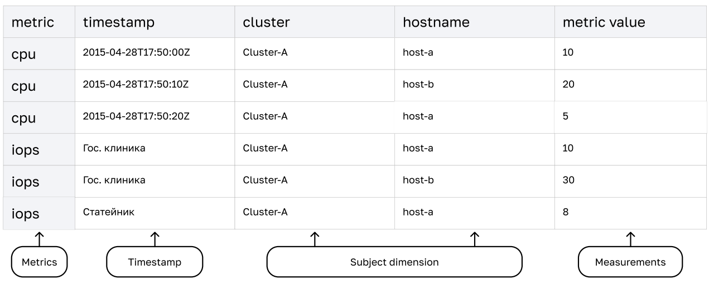

### Zabbix
Zabbix - эффективная, зарекомендовавшая себя система мониторинга. Zabbix работает в соответствии с push и pull моделью

Набор компонентов стека Zabbix:
Agent — агент для сборки метрик с хост-машин и передачи в систему хранения
Server — хранение данных конфигурации стека и статистики
Database — хранение метрик мониторинга приложений
Proxy — средство оптимизации нагрузки на server-компонент
Web UI — веб-интерфейс для менеджмента данных, их визуализации, конфигурирования стека и настроек правил оповещения

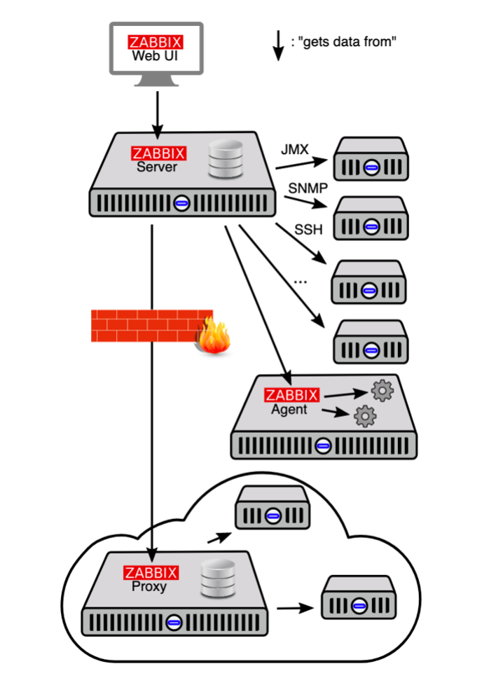

Механизм дуализма pull- и push-моделей в Zabbix заключается в настраиваемых активных и пассивных проверках.
При активных проверках указываются данные для непрерывного наблюдения, которые агент перенаправляет серверу
При пассивных проверках набор данных, которые собираются и хранятся на агенте, отправляется на сервер только по запросу

### Prometheus
Prometheus - представляет из себя набор компонентов для эффективного мониторинга систем. Prometheus работает в соответствии с pull-моделью. По сути является сборщиком метрик

Набор компонентов стека Prometheus:

Exporter — агент для сборки метрик с хост-машин и хранения их до сбора системой мониторинга

Server — хранение данных и их менеджмент

Web UI — веб-интерфейс для доступа к данным и конфигурирования системы

Alert Manager — система оповещения

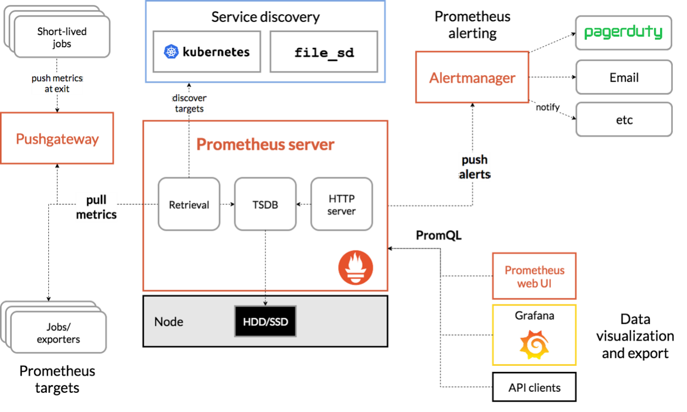

Почти весь набор компонентов Prometheus не требует дополнительных настроек и работает «из коробки».
В соответствии с характеристиками работы pull-модели нам нужно лишь указать server-компоненту узлы для сбора метрик. Это можно сделать в конфигурационном файле (формат YAML):

````yml
global:
     scrape_interval: 15s
scrape_configs:
 —  job_name: node
    static_configs:
 —  targets: [‘localhost:9100’]
````

### TICK
TICK - представляет из себя набор компонентов для эффективного мониторинга систем. TICK работает в соответствии с push-моделью.

Набор компонентов стека TICK:

Telegraf — агент для сборки метрик с хост-машин и отправки в TSDB

InfluxDB — TSDB для хранения метрик

Chronograf — компонент для визуализации и настройки данных TSDB

Kapacitor — система для настройки правил оповещения

Этот стек технологий представляет собой «коробочную» версию системы мониторинга, которую можно использовать без дополнительных инструментов

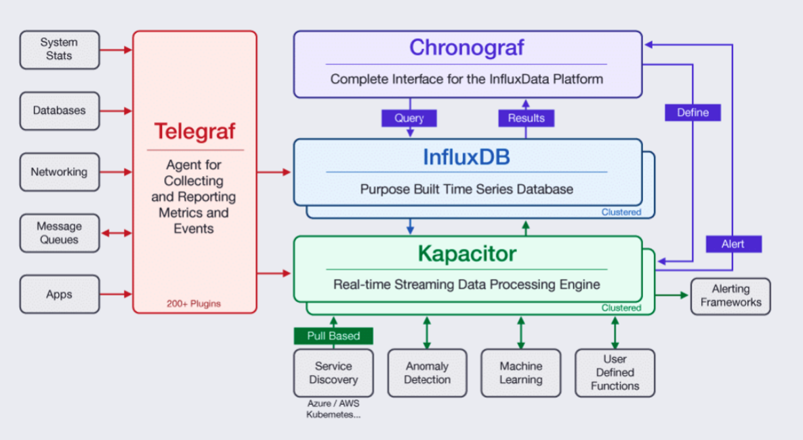

Telegraf — Golang-приложение, которое собирает метрики и отправляет их в TSDB согласно конфигурации.
Конфигурирование осуществляется через файл CONF, где указываются входные параметры для сбора и конечные системы для отправки данных

Пример конфигурации для сборки «железных метрик» сервера и передачи их в InfluxDB:

```yml
[[inputs.cpu]]
      percpu = true
      totalcpu = true
      collect_cpu_time = false
      report_active = false
[[inputs.mem]]
[[inputs.disk]]
[[inputs.kernel]]
[[outputs.influxdb]]
      urls = ["udp://1.2.3.4:8089"]
```

InfluxDB — time series database, которая взаимодействует с данными через синтаксис, подобный SQL (InfluxQL).
Конфигурирование осуществляется через файл CONF, где указываются входные параметры хранения данных, производительности БД и сетевой интерфейс для доступа к данным

Chronograf — веб-интерфейс, который предоставляет доступ к данным InfluxDB и позволяет настраивать время жизни данных и правила оповещения Kapacitor

Kapacitor — компонент для настройки правил оповещения из системы мониторинга

Пример настроенного правила оповещения:

```yml
stream
 |from()
    .measurement(‘cpu_usage_idle’)
    .groupBy(‘host’)
 |window()
    .period(1m)
    .every(1m)
 |mean(‘value’)
 |eval(lambda: 100.0 - “mean”)
    .as(‘used’)
 |alert()
    .message(‘{{ .Level}}: {{ .Name }}/{{ index .Tags 
“host”}}’)
    .warn(lambda: “used” > 70.0)
    .crit(lambda: “used” > 85.0)

  // Slack
    .slack()
    .channel(‘#alerts’)
```


### Средство визуализации Grafana

Grafana — самая популярная в мире технология визуализации, используемая для создания панелей мониторинга.
Поддерживает множество источников данных.
Имеет встроенный функционал оповещений (алёртинга) на пороговые события временных рядов.

Важно: Grafana —это не система для сбора данных. Она позволяет только визуализировать данные, находящиеся в сторонней системе хранения или мониторинга

Установив на один пк, который будет выступать в качестве сервера для Grafana, достаточно будет только запускать сбор метрик с других машин (вносить в соответствующий блок в файл конфигурации Prometheus), а Prometheus в свою очередь подготовит метрики уже для самой Grafana.

#### Источники данных
Grafana может визуализировать данные из следующих источников:

AWS CloudWatch
Azure Monitor
Elasticsearch
Google Cloud Monitoring
Graphite
InfluxDB
Loki
MSSQL
MySQL
OpenTSDB
PostgreSQL
Prometheus
Jaeger
Zipkin
Tempo
Testdata


#### Panels
Panels - это базовый инструмент визуализации в Grafana. Panel позволяет вам гибко настроить визуализацию данных из выбранного источника.

Каждая Panel имеет свой синтаксический инструмент доступа к данным в зависимости от выбранного источника данных. Например, для PostgreSQL это SQL, а для Prometheus — PromQL
Данные, представленные в визуализации, можно изменять, применяя имеющиеся в Grafana базовые преобразователи.

Также вы можете настроить параметры оповещения для данных, визуализированных на Panel

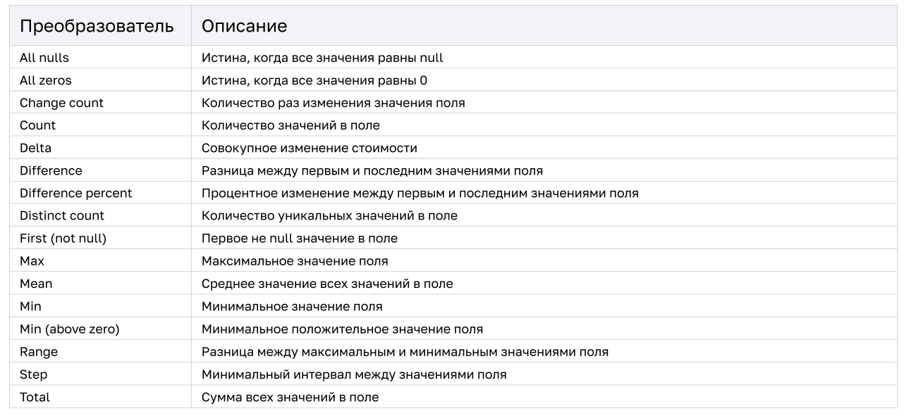

#### Dashboards
Dashboards - это объединение набора панелей, расположенных в один или несколько рядов.

Одна Dashboard может содержать Panels, подключённые к разным источникам данных, например Prometheus и InfluxDB
Dashboards позволяет указывать временной период, за который необходимо визуализировать данные на Panels. Также возможно указать частоту обновления данных на Panels при отображении данных в real-time.
Кроме того, возможна настройка шаблонизации отображения на панелях. Например, один Dashboard может показывать данныес разных серверов и позволять переключаться между ними

#### Alerting

С помощью Grafana вы можете настроить оповещения о событиях в соответствии с настроенными критериями в выбранные каналы
Оповещения настраиваются для каждой Panels
Правило оповещения — это некоторый запрос, результат которого есть бинарное булево значение
На одну Panel можно настраивать несколько правил оповещения
Grafana также предоставляет настройку поведения при отсутствии данных, когда невозможно произвести расчёт запроса правила оповещения

Список возможных каналов оповещения Grafana (можно назначать несколько каналов для одного правила):

DingDing
Discord
Email
Google Hangouts
HipСhat
Kafka
LINE
Microsoft Teams
Opsgenie
Zenduty
PagerDuty
Prometheus Alertmanager
Sensu
Sensu Go
Slack
Telegram
Threema
VictorOps
Webhook

Для добавления канала нотификации необходимо:

выбрать в меню Grafana значок с эмблемой колокольчика

нажать на меню Contact points

нажать на кнопку New contact point

заполнить поля настройки канала оповещения:
Name: название канала оповещения
Type: выбрать канал оповещения из списка
Default: назначить этот канал по умолчанию
Include image: присылать с оповещениями скриншоты графика
Disable resolve manager: убрать функционал ручного изменения состояния события из оповещения
Send reminder: осуществлять повтор оповещения при отсутствии изменения состояния события

заполнить сетевые свойства канала и нажать Save либо Send test для тестирования канала оповещения

Пример правила оповещения (среднее значение за 15 последних минут менее 14 единиц):

```yml
avg() OF query(A, 15m, now) IS BELOW 14
```

Подключение и изменение оповещения производится на вкладке Alert при настройке Panel:

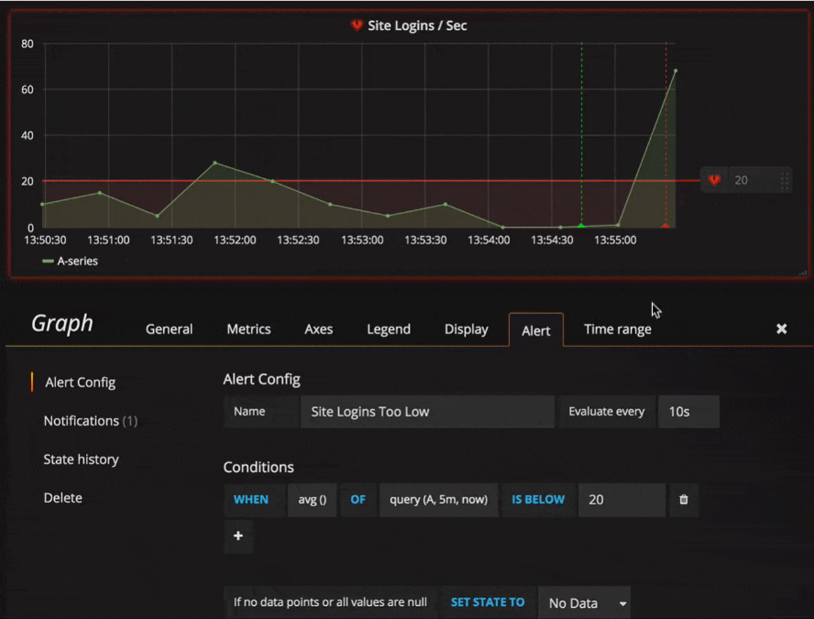


## Система сбора логов Elastic Stack

- [поднимаем elk в docker](https://www.elastic.co/guide/en/elastic-stack-get-started/current/get-started-docker.html);
- [поднимаем elk в docker с filebeat и docker-логами](https://www.sarulabs.com/post/5/2019-08-12/sending-docker-logs-to-elasticsearch-and-kibana-with-filebeat.html);
- [конфигурируем logstash](https://www.elastic.co/guide/en/logstash/current/configuration.html);
- [плагины filter для logstash](https://www.elastic.co/guide/en/logstash/current/filter-plugins.html);
- [конфигурируем filebeat](https://www.elastic.co/guide/en/beats/libbeat/5.3/config-file-format.html);
- [привязываем индексы из elastic в kibana](https://www.elastic.co/guide/en/kibana/current/index-patterns.html);
- [как просматривать логи в kibana](https://www.elastic.co/guide/en/kibana/current/discover.html);
- [решение ошибки increase vm.max_map_count elasticsearch](https://stackoverflow.com/questions/42889241/how-to-increase-vm-max-map-count).

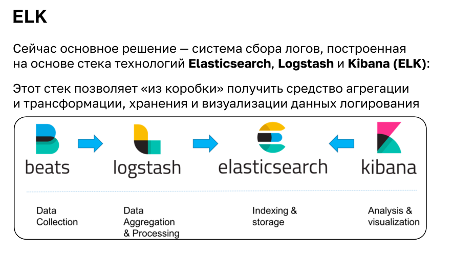

#### Beats - агенты, отправляющие логи

Централизованный сбор логов - один из важнейших разделов мониторинга позволяющий собирать, агрегировать, хранить и визуализировать данные.

Основные компоненты систем централизованного логирования:

Shipper - агент работающий на одном хосте с сервисами логи которых мы хотим собирать

Broker - опциональный компонент, представляющий собой очередь сообщений

Indexer - занимается агрегацией, трансформацие и индексацией сообщений

Storage - база данных, куда сохраняются логи

Web UI - веб-интерфейс для визуализации сообщений

На текущий момент основным решением является система сбора логов, построенная на основе стэка технологий Elasticsearch-Logstash-Kibana (ELK):


### Filebeat

Filebeat — эффективное средство сбора данных логирования из файлов и отправки в logstash/elasticsearch

В процессе сбора Filebeat может «схлопывать» данные логов при их последовательном повторе, хранить данные в буфере до восстановления конечной точки отправки, игнорировать определённые события логирования

Базовая конфигурация Filebeat довольно проста и заключается в настройке источника данных и конечной точки в конфигурационном файле filebeat.yaml

Пример настройки чтения логов nginx:

```json
- type: log
  enabled: true
  paths:
      - /var/log/nginx/access.log
  fields:
    service: nginx_access
  fields_under_root: true
  scan_frequency: 5s
```

Пример настройки отправки сообщений в Logstash:

```json
output.logstash:
  hosts: ["logstash_host:5044"]
```


### Logstash

Logstash в Elastic-стеке сбора логов — инструмент для приёма данных, их преобразования и отправки в кластер БД Elasticsearch
Конфигурирование Logstash осуществляется через специальный конфигурационный файл

Обработка сообщений осуществляется с помощью пайплайнов, которые состоят из 3 секций:
input
filter
output

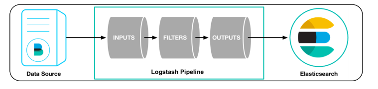

Графа input конфигурационного файла задаёт входные точки Logstash
Это может быть интерактивный обмен, сетевое соединение, файл и т. д.

Также указывается тип входных событий для их оптимальной обработки, например syslog

```yml
input {
 tcp {
 port => 5000
  type => syslog
 }
 udp {
 port => 5000
  type => syslog
 }
}
```

Графа filter отвечает за парсинг входных данных и преобразование их в необходимую структуру
Logstash имеет множество стандартных парсеров входных данных, но самый универсальный — grok. Но он наименее производительный.

В этой графе можно указать, в какие ключи складывать данные, вставлять унарные операторы в случае особых входных событий и т. д.

```yml
filter {
 [path] =~ {
 mutate { replace => { type => } }
grok {
match => { => }
  }
  date {
 match => [ , ]
  }
 } [path] =~ {
 mutate { replace => { type => } }
 } else {
 mutate { replace => { type => } }
 }
}
```
Графа output отвечает за конечную точку для отправки данных из Logstash.
Можно указать несколько конечных точек для параллельной отправки данных: файлы, Elasticsearch.

Также для каждой конечной точки существуют дополнительные гибкие настройки: добавление даты в название файла или применение шаблона индексов в Elasticsearch к данным

```yml
output {
 elasticsearch { hosts => [ ] }
 stdout { codec => rubydebug }
}
```


### Elasticsearch

Elasticsearch — база данных, адаптированная для полнотекстового поиска

Основные особенности:     
производительный полнотекстовый поиск
быстрая индексация каждого слова в сообщении (хранит в json)
масштабируемая база данных (помогает в кластере ELC вывести ноды на обслуживание без аффекта на инфраструктуре)
есть возможность репликации и шардирования

Каждый экземпляр elasticsearch может иметь ряд ролей:

master — отвечает за целостность кластера и выполнение фоновых задач
data — хранит данные
ingest — принимает данные и трансформирует их в соответствии с заданным пайплайном
ml — обрабатывает данные с использованием машинного обучения
coordinator — обрабатывает входящие запросы (все экземпляры имеют эту роль)

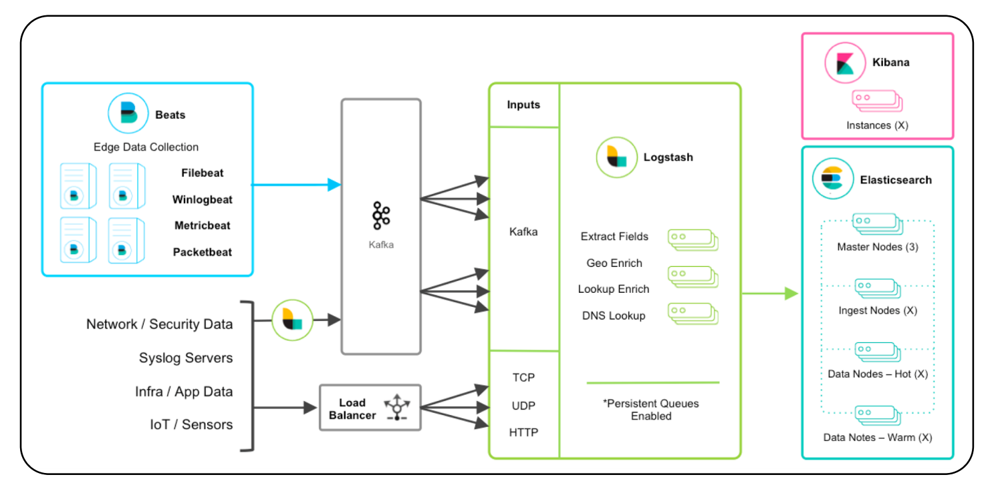


### Построение кластера

Кластерные узлы, помеченные как hot, хранят и собирают «быстрые» данные логирования, например за последние сутки.
Такие узлы требовательны к скорости операций чтения/записи диска и, соответственно, хранят данные на SSD-носителях.
Обычно им не требуется большой размер носителя, так как время хранения данных на таких узлах небольшое

Кластерные узлы, помеченные как warm, хранят и собирают «медленные» данные логирования. Например, всё, что следует за текущими сутками.
Такие узлы не требовательны к операциям чтения/записи диска, но требовательны к объёму. Соответственно, хранить данные можно только на HDD-носителях.
Также возможно использовать cold-узлы, которые хранят данные старше 30 дней

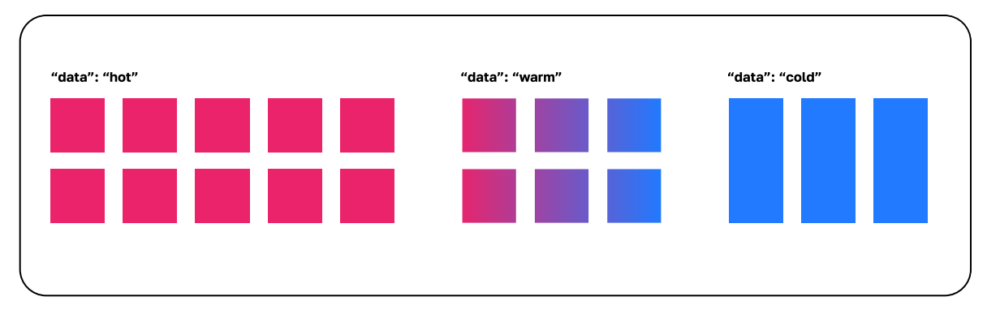


### Index lifecycle management

Index lifecycle management (ILM) — процесс перемещения индексов (данных) между нодами в архитектуре Hot-Warm
Он настраивается с помощью API Elasticsearch.
Настройка процесса перемещения индекса между узлами называется политикой
В политике можно указать триггер перемещения индекса по времени или по размеру индекса primary shard на ноде определённого типа

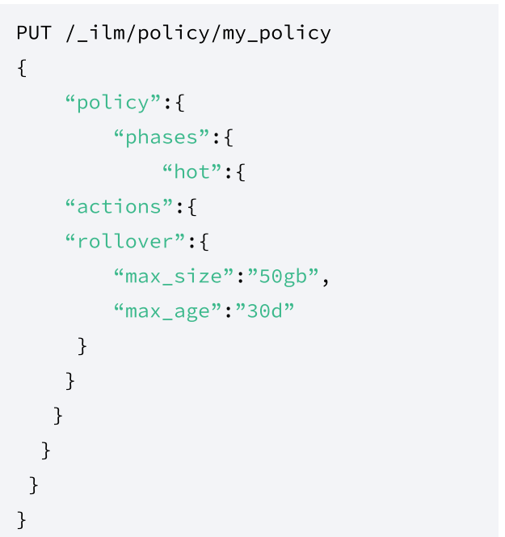

Чтобы привязать индекс к политике, необходимо указать шаблон, в котором установлено, к каким индексам применяется эта политика
В шаблоне индексов вы можете использовать wildcard и распространить шаблон на несколько или на все индексы.

Также в шаблоне необходимо указать псевдоним (alias) для индекса

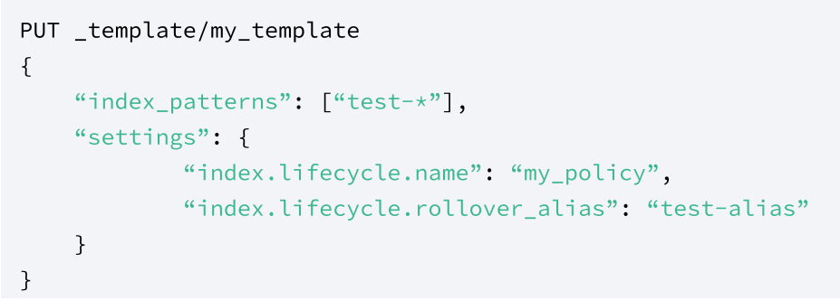

Привязка псевдонимов также происходит через API Elasticsearch
Псевдонимы упрощают поиск индексов между нодами кластера и ограничивают операции записи только на индексы hot-узлов

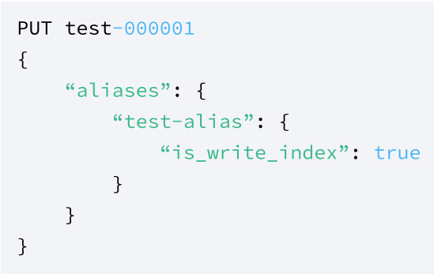

#### Пример политики hot-warm-cold

На этом этапе устанавливаем высокий приоритет индекса, чтобы горячие индексы восстанавливались раньше других при перезагрузке узла.
Через 30 дней или 50 ГБ (в зависимости от того, что наступит раньше) индекс будет обновлён (перенесён), и будет создан новый индекс.

Новый индекс запустит политику заново, а текущий индекс будет перенесён в warm-фазу

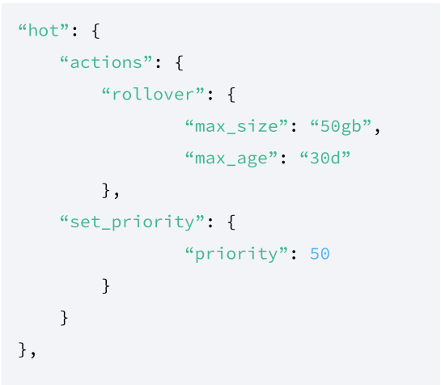

Когда индекс перейдёт в тёплую фазу:
сократится количество его шардов до 1
установится приоритет индекса на значение, которое ниже hot (но больше, чем cold)
произойдёт миграция индекса на warm-узлы срок жизни в warm-фазе составляет 23 дня

P.S.: min_age указывает, сколько должно минимально пройти времени с создания индекса до перехода в какую-либо фазу

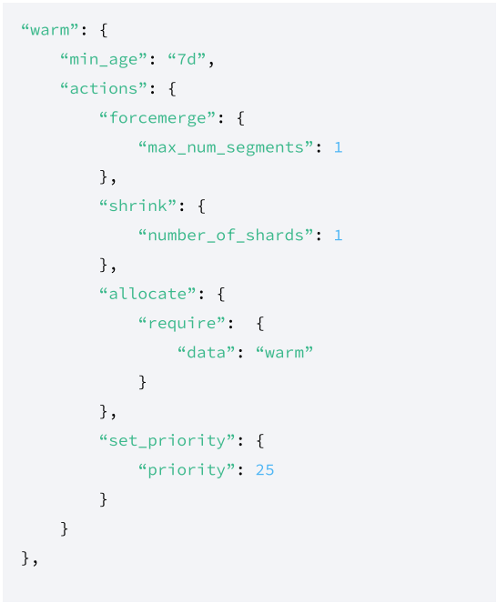

При переходе в холодную фазу:
Индекс заморозится. То есть станет недоступным, но будет храниться. Его можно будет использовать в будущем
Установится минимальный приоритет восстановления индекса
Произойдёт миграция индекса на cold-узлы
Срок жизни индекса в cold-фазе составляет 30 дней

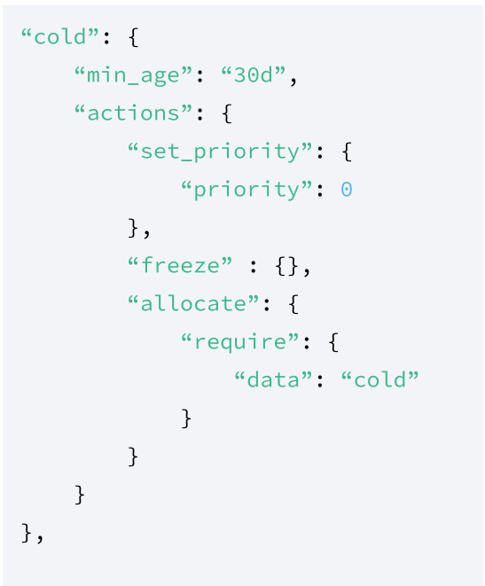

Эта фаза управляет удалением индексов
В текущей политике указано, что индекс должен быть удалён по истечении срока его жизни — 60 дней — вне зависимости от его фазы

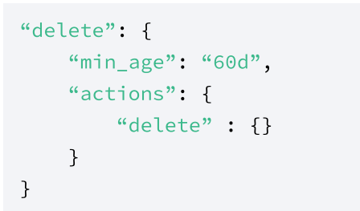

#### Настройка Elasticsearch

Указание типа узла происходит путём добавления конфигурации в elasticsearch.yml
(прочие настройки стандартны для кластера Elasticsearch):

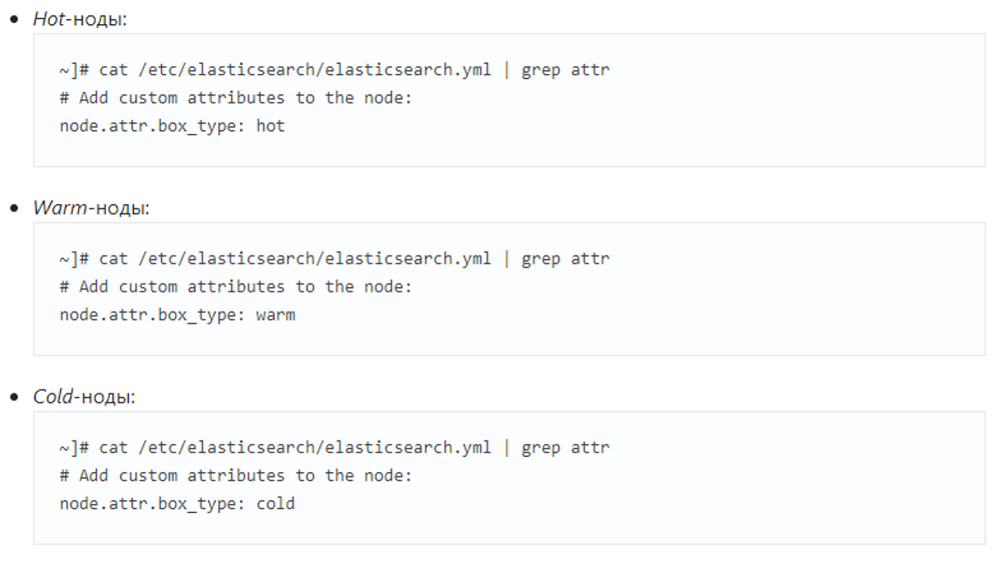


### Kibana

Kibana — эффективное средство визуализации данных логов
В Kibana можно выводить текстовые данные и сортировать логи по определённым значениям. Например, уровням логирования.
Можно проводить агрегацию данных и визуализировать их в виде диаграмм, графиков или интерактивных карт

Базовая настройка Kibana довольно проста и заключается лишь в указании интерфейса, на котором она доступна, и конечных точек источников данных в виде массива сетевых параметров узлов Elasticsearch

Kibana - Index Patterns  - создание паттернов для индексов
Name - поле с возможностью wildcard маски для отбора по названию

Пример настройки Kibana:

```yml
server.host: “123.456.789”
elasticsearch.url: “[https://123.456.789:9200](http://123.456.789.9200/)”
```

Интерфейс поиска логов:

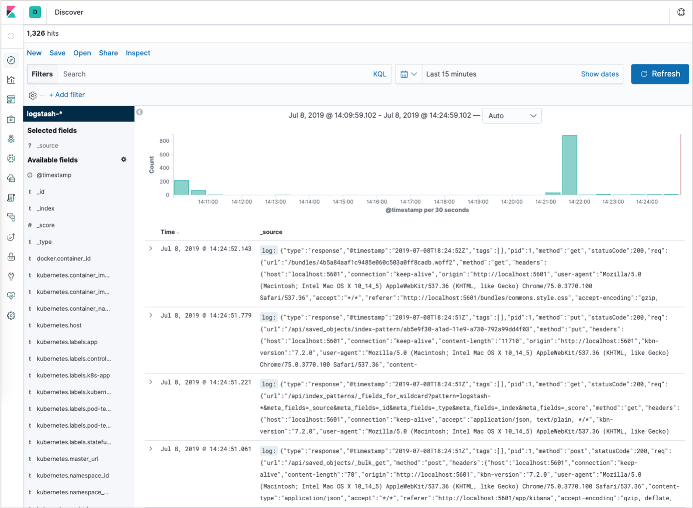

Данные с геолокацией:

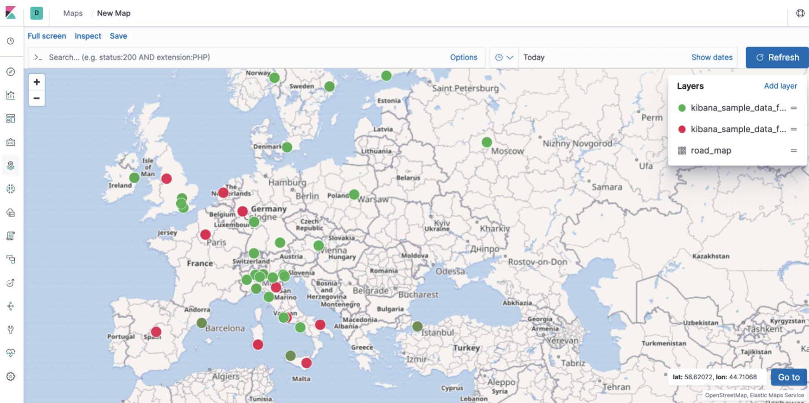

Дашборды:

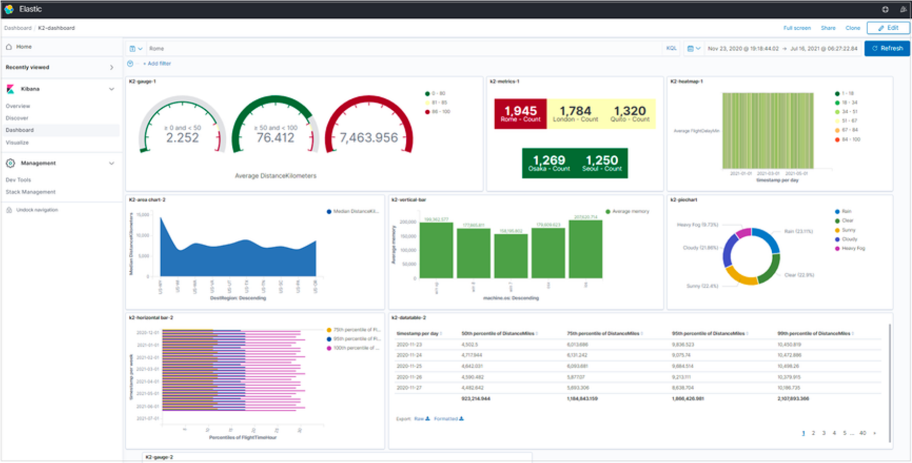

