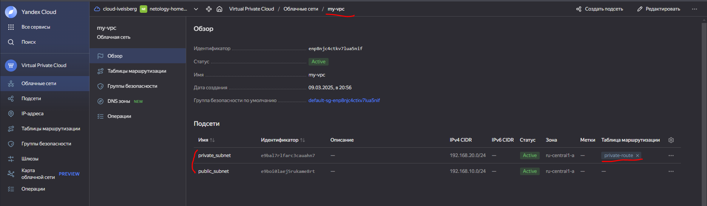
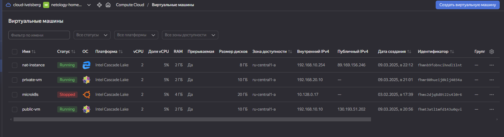
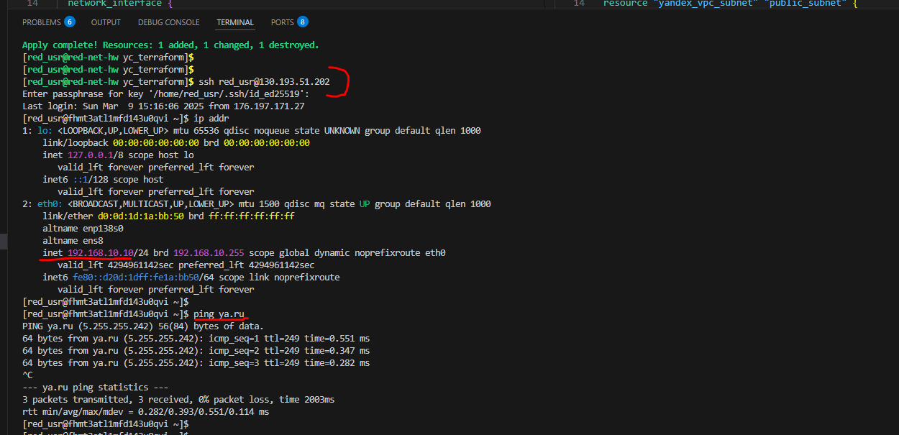
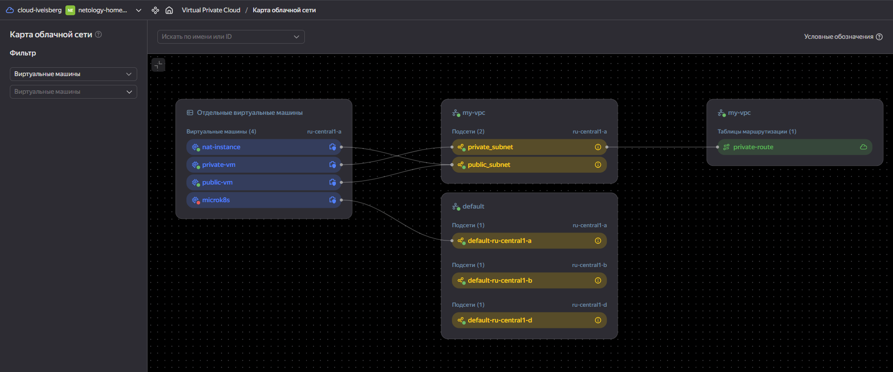
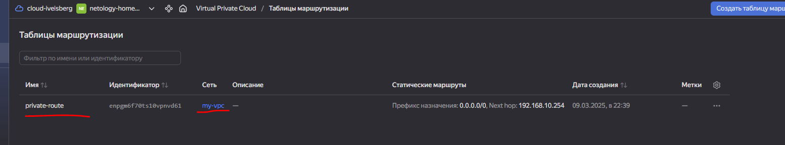
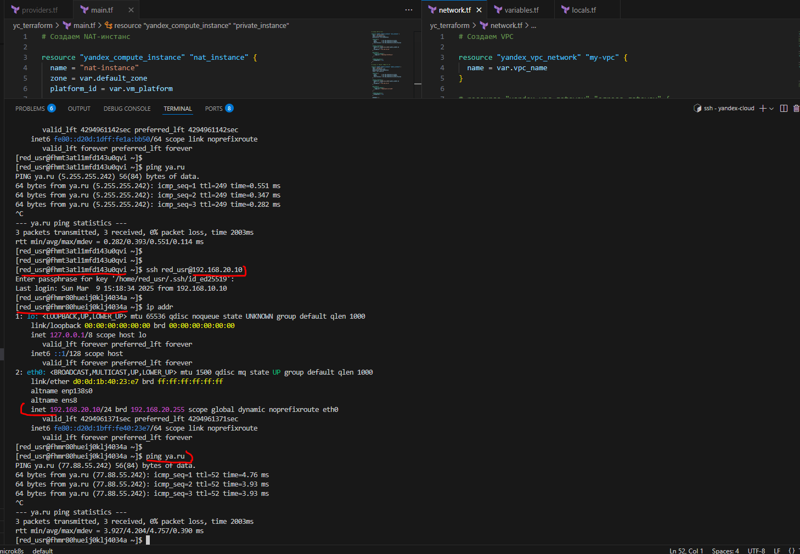

Домашнее задание к занятию «Организация сети»

Обязательные задания

## Задание 1. Yandex Cloud

- 2. Публичная подсеть.

- 3. Приватная подсеть.

# Манифесты:

[main](main.tf)

[network](network.tf)

[variables](variables.tf)

[locals](locals.tf)
