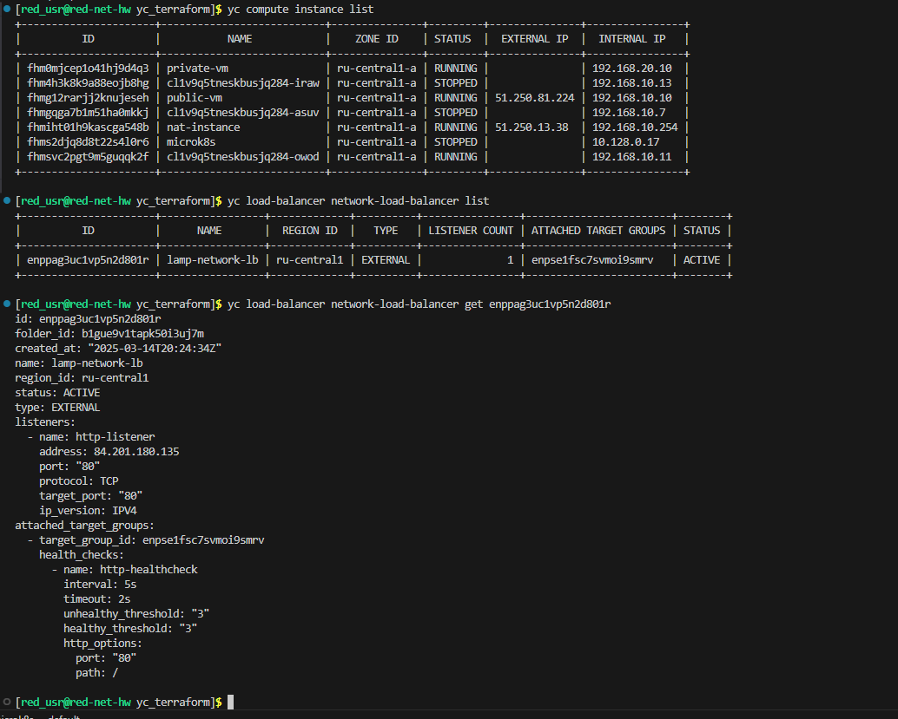

Домашнее задание к занятию «Вычислительные мощности. Балансировщики нагрузки»

Обязательные задания

## Задание 1. Yandex Cloud

- 1

Ссылка - https://storage.yandexcloud.net/iveisberg-14-03-2025/image.jpg

- 2

- 3

- 4

# Манифесты:

[bucket](bucket.tf)

[locals](locals.tf)

[variables](variables.tf)

[tproviders](providers.tf)

[app_lb](app_lb.tf)

[network_lb](network_lb.tf)

[network](network.tf)
