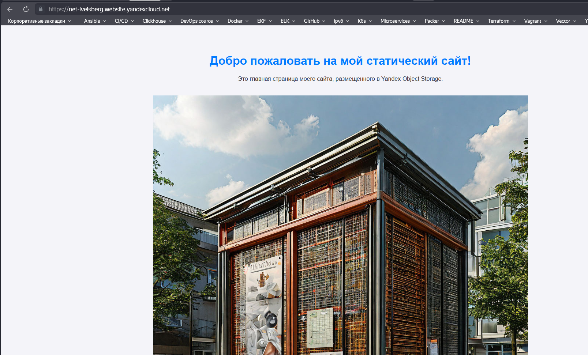

Домашнее задание к занятию «Безопасность в облачных провайдерах»

Обязательные задания

## Задание 1. Yandex Cloud

- 1

- 2

# Манифесты:

[bucket](bucket.tf)

[site](site.tf)

[index](index.html)

[error](error.html)
